# vrr_agent_open

**A waterflood surveillance assistant where the model never does the arithmetic — and
never gets the last word on it.** Every figure is computed by deterministic code with its
source attached, and the sentence wrapped around it is checked against those figures
before you see it. Fully local, fully open-source, zero cloud cost.


---

## 0. What this is, and the problem it solves

### The physical problem

When an oil reservoir is produced, fluid leaves the rock and the pressure drops. Drop far
enough and the oil stops flowing to the wells — and the barrels you did not get out
early are largely barrels you never get out at all. So operators **inject water** into
the same reservoir to hold the pressure up. That is a *waterflood*, and a **pattern** is
one injection well plus the producers it sweeps toward.

The number that says whether it is working is the **Voidage Replacement Ratio**:

> **VRR = reservoir volume put in ÷ reservoir volume taken out**

Both measured *down in the reservoir*, not at the surface — a barrel of oil shrinks on
the way up as its dissolved gas comes out, so surface barrels do not compare. Converting
between the two is the PVT step, and it is where most of the arithmetic lives.

| VRR | What it means | What it costs you |
|---|---|---|
| **≈ 1.0** | replacing what you take out | pressure holds — the goal |
| **< 1.0** | under-injecting | pressure falls, oil flows more slowly, recovery is lost |
| **> 1.0** | over-injecting | water arrives at the producers early, and you pay to lift and re-separate water you did not need to inject |

### Why the industry cares

Waterflooding is not a niche technique — it is how a large share of the world's mature
oil fields are produced, and it is usually the difference between recovering roughly a
tenth of the oil in place and recovering a third of it. The rock does not give the oil
back later: pressure lost early is recovery lost permanently. That makes VRR one of the
few numbers on a mature asset that is genuinely irreversible if you get it wrong for
long enough.

It is also expensive in both directions, which is why it gets watched monthly rather
than annually:

| | What it actually costs |
|---|---|
| **Chronic under-injection** | Reservoir pressure falls below the bubble point, dissolved gas breaks out of the oil in the rock, and the oil that is left behind becomes much harder to move. Some of that loss cannot be recovered by injecting harder later. |
| **Chronic over-injection** | Injected water short-circuits to the producers instead of sweeping oil. You then pay three times — to inject it, to lift it back out, and to separate and dispose of it — while the water cut climbs and the well's economic life shortens. In the worst case the injection pressure exceeds the fracture gradient and the water leaves the target zone entirely. |
| **Getting it wrong on the wrong pattern** | Injection is a shared system. Turning one injector down changes the balance for every producer it touches, including ones allocated to a neighbouring pattern. |

A field-wide VRR near 1.0 can also hide the problem entirely: patterns at 0.7 and 1.3
average out to something that looks healthy while both are being managed badly. The
useful unit is the individual pattern, which is why this app is organised around one.

None of this is exotic engineering — the formula is a ratio. What makes it hard in
practice is that the inputs are messy (allocated volumes, time-windowed contribution
factors, an interpolated PVT table), the surveillance is repetitive, and the cost of
acting on a number that was never real is paid months later by someone else. That
combination is exactly where a careful assistant helps and a confident one does damage.

### The operational problem

A reservoir engineer may carry dozens of patterns. Each month, for each one, the same
questions: *did the VRR actually move, or is this a bad allocation factor? What drove
it — less water in, or more oil out? Should I change the injection rate, and by how
much?* The inputs are thousands of daily allocated volumes, time-windowed contribution
factors, and a PVT table that often has to be interpolated. It is slow, and it is easy
to act on a number that was never real.

That looks like a job for an LLM. It is — **but only for part of it.** A model that
invents a plausible figure here is worse than no tool at all, because the output of this
workflow is a **valve change on a real well**. A hallucinated 12% injection cut is not a
wrong answer on a screen; it is a pressure decline nobody notices for a quarter.

### What this project does about it

It splits the work at exactly that line. The LLM **chooses which tool to call** and
**phrases the result**. It never produces a figure, never picks a magnitude, never
decides an input is trustworthy. Everything else is deterministic Python with
provenance attached, and five mechanisms enforce the split:

| | |
|---|---|
| **Deterministic tools** | every number comes from `core/` via a tool, with the table and keys it came from |
| **Input audit** | a period whose raw data looks like an artifact is vetoed *before* any recommendation — it routes to a data steward instead |
| **Faithfulness gate** | narration is checked against the tool output; unsupported drivers, wrong direction, or uncited figures are rejected and replaced |
| **Physics-computed, clamped recommendations** | the size of a change comes from the physics and a learned per-pattern response factor ρ, then is clamped by safety limits |
| **Human approval chain** | the agent may only write a *draft*; every stage after it is a person, and the executed outcome feeds ρ back |

> **What that claim does and does not mean.** The model can still write a wrong number —
> nothing prevents a language model from typing one. What the design gives you is that it
> never *computes* the number, and that its wording is verified against the tool output
> and **discarded and replaced** when the two disagree. That is a catch, not an
> impossibility, and the catch has edges worth knowing: `core.faithfulness.check_numbers`
> matches decimals only, so an integer like "cut injection by 12%" or a figure written in
> words ("about a tenth") is not number-checked — those are covered by the
> `unsupported_driver` and `wrong_direction` rules instead, and by the fact that the
> *recommendation itself* is computed rather than narrated. The `general` intent answers
> from the model's own knowledge and is labelled "not your data" on screen precisely
> because that path has no such guarantee.

The result is an agent that will say **"I don't know"** — the RAG path abstains below a
measured similarity floor rather than guessing — and whose every on-screen figure can be
recomputed from raw rows in front of you (that is what the **Lineage & audit** view does).

### What you actually get

A local workbench — four views and a chat drawer over a 25-endpoint API — branded as a
fictional operator, **Meridian Petroleum**. Portfolio triage, a per-pattern report with a
well-pattern schematic, a derivation graph from raw tables to the final number, and a
swim-lane approval board.

> **The data is synthetic.** `pipeline/seed.py` generates it from a fixed seed. No real
> field data is in this repo, and Meridian Petroleum is not a real company.

### Where it came from

The deterministic heart (`core/` — physics, anomaly rules, recommendation, the
faithfulness gate) is lifted **verbatim**, with its unit tests, from a Databricks/Mosaic
AI implementation of the same agent. That is the point of the exercise: the architecture
— deterministic core, agentic reasoning, governance, closed-loop learning — is portable
off any single vendor, and `core/` is provider-agnostic Python that proves it. Nothing in
this repo requires Databricks, or any cloud account, to run.

---

## Contents

| | |
|---|---|
| [0. What this is](#0-what-this-is-and-the-problem-it-solves) | **start here** — VRR, the problem, and the one boundary |
| [1. The one idea](#1-the-one-idea-the-llm-never-computes) | where the model is allowed to act |
| [2. System map](#2-system-map) | every component and how they connect |
| [3. Data model](#3-data-model--three-schemas-raw--curated--agent) | three schemas, raw → curated → agent |
| [4. The physics](#4-the-physics--how-a-vrr-number-is-built) | PVT ladder → reservoir volumes → VRR |
| [5. The agent](#5-the-agent--a-real-langgraph-stategraph) | LangGraph StateGraph, node by node |
| [6. Analyst pipeline](#6-the-analyst-pipeline--five-steps-in-this-order) | verify → attribute → classify → propose → draft |
| [7. Faithfulness gate](#7-the-faithfulness-gate--what-actually-blocks-a-wrong-answer) | the three violations it catches |
| [8. RAG](#8-rag--ingest-chunking-retrieval-and-knowing-when-to-abstain) | ingest, measured chunking, abstention |
| [9. Closed loop](#9-the-closed-loop--approval-execution-and-learned-ρ) | approval chain and ρ learning |
| [10. Evaluation](#10-evaluation--prompts-traces-scorers-judges) | prompts, traces, scorers, judges |
| [11. Observability](#11-observability--the-trace-span-tree) | the MLflow span tree |
| [12. Governance](#12-governance--unity-catalog-as-catalog-of-record) | Unity Catalog, honestly |
| [12b. The workbench](#12b-the-workbench--react-over-fastapi) | React over FastAPI, and why the split |
| [12c. API security](#12c-authentication--oauth2-password-grant--jwt-bearer) | OAuth2 + JWT, and what it does not cover |
| [12d. Sharing publicly](#12d-sharing-the-workbench-publicly--make-share) | ngrok, and the defaults that must change first |
| [13. Run it](#13-run-it) | every make target |
| [14. Repo layout](#14-repository-layout) | where everything lives |
| [15. Status](#15-status--what-is-real-and-what-is-not) | what is real, what is not |

---

## 1. The one idea: the LLM never computes

Every design decision below follows from one boundary. The model may **choose tools**
and **phrase results**. It may not produce a figure, pick a magnitude, or decide that
an input is trustworthy.

```mermaid
%%{init: {'theme':'base','themeVariables':{'fontFamily':'ui-sans-serif, system-ui, -apple-system, sans-serif','fontSize':'13px','lineColor':'#64748b','primaryColor':'#eef1f4','primaryTextColor':'#1f2937','primaryBorderColor':'#64748b','secondaryColor':'#e3edf6','tertiaryColor':'#eef1f4'},'flowchart':{'htmlLabels':true,'padding':10,'nodeSpacing':46,'rankSpacing':54,'curve':'basis','useMaxWidth':true},'sequence':{'useMaxWidth':true,'boxMargin':8}}}%%
flowchart LR
    subgraph MODEL["🤖 What the LLM may do"]
        direction TB
        M1["pick which tool to call"]
        M2["phrase a computed result"]
        M3["answer general theory, labelled as such"]
    end
    subgraph NEVER["🚫 What it may never do"]
        direction TB
        N1["produce a number"]
        N2["choose a change magnitude"]
        N3["decide inputs are trustworthy"]
        N4["approve or execute anything"]
    end
    subgraph DET["⚙️ Deterministic, provenance-carrying"]
        direction TB
        D1["core/physics.py — PVT + volumes"]
        D2["core/decompose.py — exact LMDI split"]
        D3["core/anomaly.py — detection rules"]
        D4["core/recommend.py — rho + safety clamps"]
        D5["core/audit.py — input verdict"]
        D6["core/approval.py — human chain"]
    end
    MODEL --> GATE{{"core/faithfulness.py GATE"}}
    DET --> GATE
    GATE -->|"verified"| OUT["answer reaches the analyst"]
    GATE -->|"rejected"| FALLBACK["computed attribution shown instead"]
    NEVER -.->|"structurally impossible"| DET

    classDef data fill:#e3edf6,stroke:#2d6b91,stroke-width:1px,color:#12374d;
    classDef bad fill:#fde5e5,stroke:#c53030,stroke-width:1px,color:#7f1d1d;
    classDef ok fill:#dff3e6,stroke:#2f855a,stroke-width:1px,color:#14532d;
    classDef warn fill:#fdf2d9,stroke:#b7791f,stroke-width:1px,color:#713f12;
    class MODEL data;
    class NEVER bad;
    class DET ok;
    class GATE warn;
```

A useful way to read the rest of this document: **every arrow that carries a number
starts in the green box.**

---

## 2. System map

The whole system on one page. Corrections against the obvious reading are called out
under it — the two that matter most are that the **approval chain does not go through the
tool layer**, and that `vrr_curated` is written by an **offline build**, not at request
time.

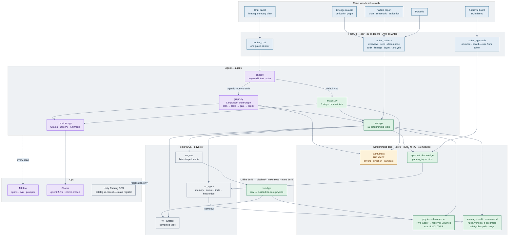

**Five things the diagram is drawn to get right**, because the intuitive version of each is
wrong:

1. **The approval chain does not pass through the tool layer.** `routes_approvals.py`
   imports `core.approval` and the DB helpers directly. The agent may only ever write a
   *draft*; every stage after that is a person, and routing human decisions through the
   agent's toolbelt would blur exactly the line this project exists to keep.
2. **`vrr_curated` is written offline, not at request time.** `pipeline/build.py` reads
   `vrr_raw` and materialises curated *using* `core.physics`. At request time the tools
   READ curated — and `VRR_AUDIT` re-runs the same physics on raw rows to check the two
   still agree. That recompute is the point of the Lineage view.
3. **The gate sits on both answer paths**, not just the agentic one. Default and agentic
   are gated identically; the difference is who picks the tools, never whether the output
   is verified.
4. **ρ flows backwards.** `vrr_agent` feeds `core.recommend` — the learned response factor
   from executed adjustments is an input to the next recommendation. That back-edge is the
   closed loop.
5. **Unity Catalog is registration only.** `make register` publishes schemas and tables as
   a catalog-of-record. It does not sit in the query path, and it does not enforce
   anything at runtime — see [§12](#12-governance--unity-catalog-as-catalog-of-record).

### The same thing as a poster

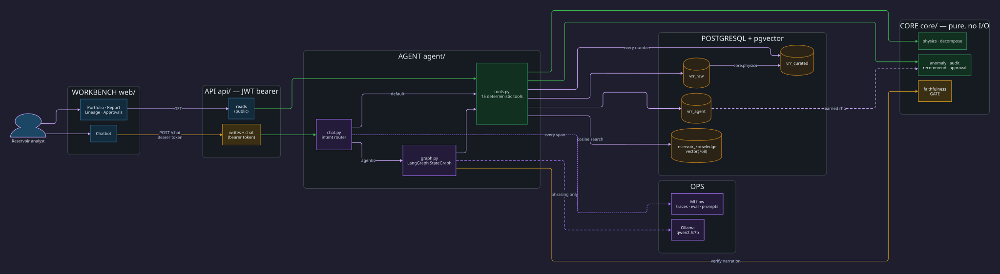

> `make diagram` regenerates this from [docs/architecture.d2](docs/architecture.d2) (D2)
> and also renders an icon-based PNG from
> [scripts/make_architecture_diagram.py](scripts/make_architecture_diagram.py) (Graphviz).
> Both are *posters* — the mermaid below is the maintained one, because it lives in the
> text and shows up in a diff.

### Stack, and why each piece

| Concern | Tool | Why this one |
|---|---|---|
| Data + compute | **PostgreSQL** | VRR is pure SQL — no Spark needed at this scale |
| Knowledge index | **pgvector** | same DB: one store, one backup, one connection |
| Agent loop | **LangGraph** `StateGraph` | reducers make evidence append-only; the gate is an *edge* |
| Narrator | **Ollama** (`qwen2.5:7b`) | local + free; OpenAI/Anthropic pluggable, billable, off by default |
| Embeddings | **nomic-embed-text** | 768-dim, local, matches the `vector(768)` column |
| Governance | **Unity Catalog OSS** | catalog-of-record (RBAC + lineage) — [not a query engine](#12-governance--unity-catalog-as-catalog-of-record) |
| Tracing / eval / registry | **MLflow OSS** | span trees, scorers, prompt versioning |
| UI | **React + Vite + TypeScript + Tailwind** | 4 views + a docked chat drawer, talking to FastAPI |
| API | **FastAPI** | the same tools over HTTP — and where the approval role checks live |

---

## 3. Data model — three schemas, raw → curated → agent

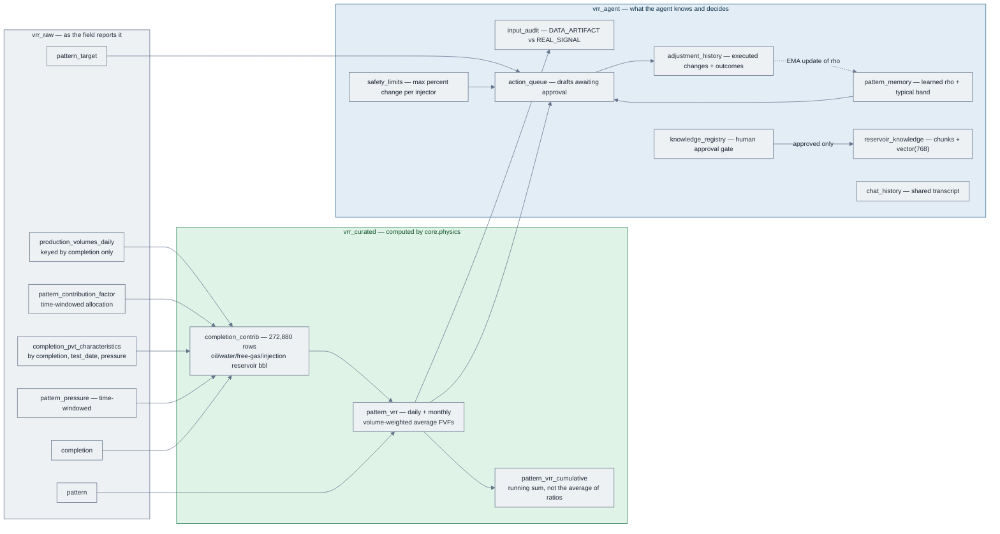

Aligned to the production VRR data model: volumes keyed by **completion only**,
time-windowed allocation and pressure, PVT by `(completion, test_date, pressure)`,
derived `Amount_Type`, a `HAVING` gate, and cumulative VRR as a **running sum of
reservoir volumes** — never the average of monthly ratios. Details and the local
deviations: [docs/vrr_data_model.md](docs/vrr_data_model.md).

---

## 4. The physics — how a VRR number is built

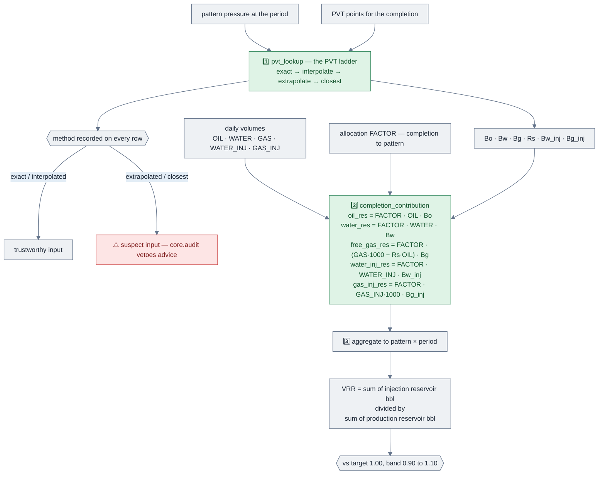

**Why the PVT method is carried all the way through:** a VRR built on an *extrapolated*
lookup is a number with unquantified error. `core/audit.py` turns that into a verdict —
`DATA_ARTIFACT` (fix the inputs, no valve change) vs `REAL_SIGNAL` (diagnose and
recommend) — and the guardrail *never recommend on suspect inputs* is enforced in code,
not in a prompt.

---

## 5. The agent — a real LangGraph `StateGraph`

`agent/graph.py`. Compiled once per process with an `InMemorySaver` checkpointer;
`build().get_graph().draw_mermaid()` regenerates the topology from the code.
`tests/test_graph.py` pins the edges with the model and Postgres stubbed.

### Topology — five nodes, nine edges

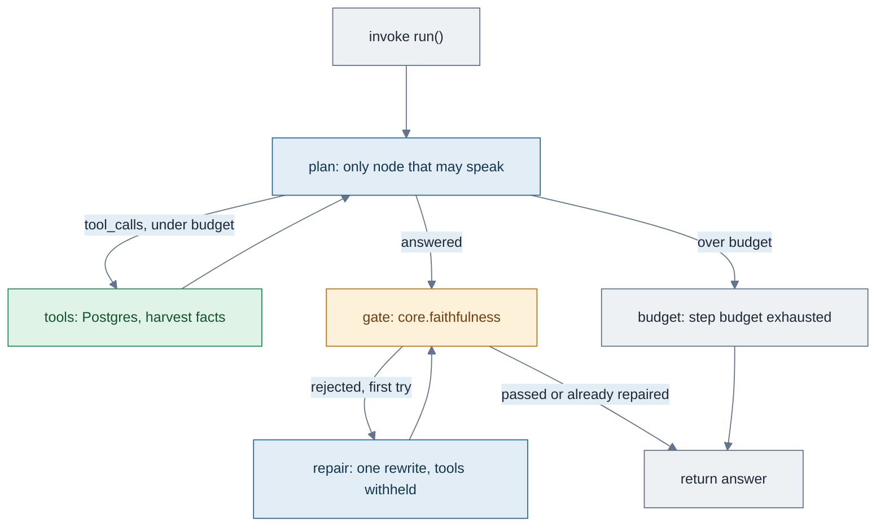

| Node | Function | Speaks? | State it writes |
|---|---|---|---|
| `plan` | the model picks a tool from the 16 specs, or answers | yes | `messages` (+assistant), `steps` |
| `tools` | runs them over Postgres; harvests every returned number into `facts` | no | `messages` (+tool), `trace`, `facts`, `last_decompose` |
| `gate` | `core.faithfulness` — drivers, directions, tool-sourced numbers. A rejected answer is replaced by the computed attribution before anything leaves | no | `answer`, `gate` |
| `repair` | one rewrite with the violation fed back; **tools withheld** so the model cannot fish for new numbers | yes | `messages` (+assistant), `repaired=True` |
| `budget` | terminal when `max_steps` model turns are spent still calling tools | no | `answer`, `gate` |

Two **conditional** edges decide the route (`after_plan`, `after_gate`); everything else is unconditional.

| From | To | When |
|---|---|---|
| `START` | `plan` | always |
| `plan` | `tools` | `after_plan`: last message has `tool_calls` and `steps < max_steps` |
| `plan` | `gate` | `after_plan`: the model answered (no `tool_calls`) |
| `plan` | `budget` | `after_plan`: `tool_calls` but `steps >= max_steps` |
| `tools` | `plan` | always — the loop |
| `gate` | `END` | `after_gate`: passed, already repaired, or no LLM to repair with |
| `gate` | `repair` | `after_gate`: rejected, first attempt, LLM available |
| `repair` | `gate` | always — repaired text is gated too |
| `budget` | `END` | always |

The one path that does **not** go through `gate` is the budget: `plan → budget → END`. Every *answer* still goes through `gate`, including the rewrite (`repair → gate`, never `repair → END`).

### State management — reducers, patches, checkpointer

`State` is a `TypedDict`. LangGraph merges each node's **patch** into the current state; a node never returns the whole object. The `Annotated[..., operator.add]` fields are the append-only evidence trail: a node returns only what it **adds**, so nothing already computed can be overwritten by a later step.

```python
class State(TypedDict, total=False):
    messages:       Annotated[list[dict],  operator.add]   # append-only
    trace:          Annotated[list[dict],  operator.add]   # append-only  {tool, args, result}
    facts:          Annotated[list[float], operator.add]   # append-only  numbers the answer may cite
    last_decompose: dict | None      # newest VRR_DECOMPOSE — what the gate checks against
    answer: str
    gate: dict
    steps: int                       # plan turns taken
    max_steps: int                   # seeded at invoke
    repaired: bool
    model: str | None                # seeded at invoke
```

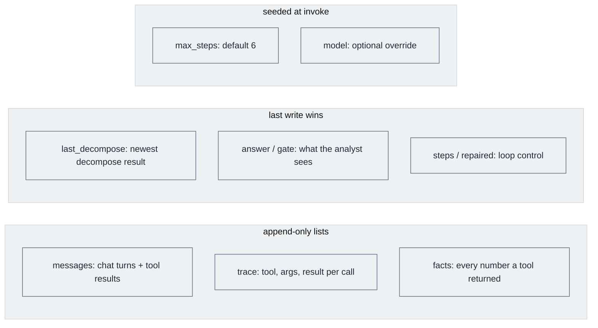

Who writes which keys (a node returns a **patch**, never the whole `State`):

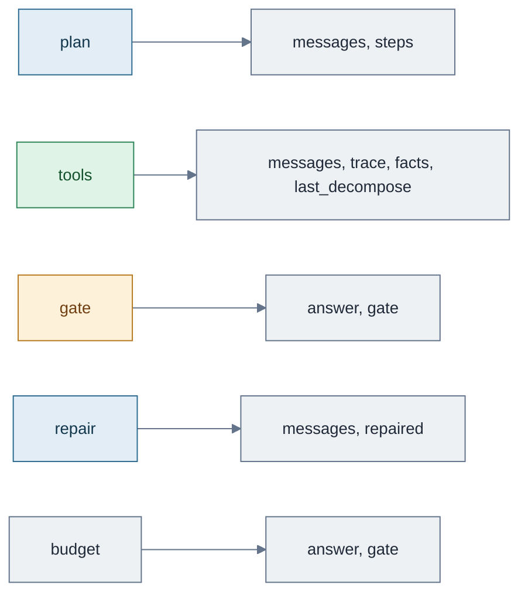

The graph is compiled once per process (`GRAPH = build()`). `InMemorySaver` stores the full `State` under `thread_id`. A fresh `run()` seeds `messages` / `steps` / `max_steps` / `model` / `repaired` and empty `trace` / `facts` / `last_decompose`. Passing the same `thread_id` **does not** reset those three evidence fields — the next question is appended onto the existing trail. `recursion_limit` is `max_steps * 3 + 10`, because one model turn can fan out to tools and back.

| Property | Mechanism |
|---|---|
| Evidence cannot be dropped | `operator.add` reducers on `messages` / `trace` / `facts` |
| An *answer* cannot skip the gate | every path that produces narration goes `plan → gate`; `repair → gate`, never `repair → END` |
| The budget is the exception | `plan → budget → END` when the model keeps calling tools past `max_steps` |
| Repaired text is gated too | `repair → gate` |
| Runs resume | compiled with `InMemorySaver`; `run(..., thread_id=…)` continues |
| Runaway loops stop | `max_steps` model turns + a `recursion_limit` backstop |

### The 16 deterministic tools

| Group | Tools |
|---|---|
| Discover | `LIST_PATTERNS` · `VRR_OVERVIEW` · `PATTERN_CONTEXT` · `LIST_COMPLETIONS` · `PATTERN_LAYOUT` |
| Measure | `VRR_GET` · `VRR_TREND` · `VRR_DECOMPOSE` |
| Verify | `VRR_AUDIT` (recompute from raw) · `INPUT_AUDIT` · `DATA_QUALITY` · `VRR_LINEAGE` |
| Decide | `DETECT_ANOMALIES` · `RECOMMEND_CHANGE` · `FIND_PRECEDENT` |
| Recall | `SEARCH_KNOWLEDGE` (pgvector, RETRIEVER span) |

A tool error is returned as `{"error": …}` data, never raised — a broken tool must not
crash the loop; it must be something the model can see and route around.

### Two modes, gated identically

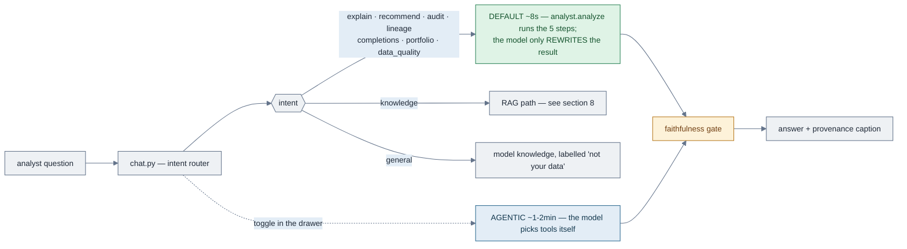

On a local 7B the agentic loop gets caught fabricating figures more often (it likes to
compute daily averages). When it does, the computed answer is shown with the violation
displayed — **the designed outcome, not a failure.**

---

## 6. The analyst pipeline — five steps, in this order

`agent/analyst.py`. The order is the argument: you cannot attribute a number you have
not verified, and you must not recommend on inputs you do not trust.

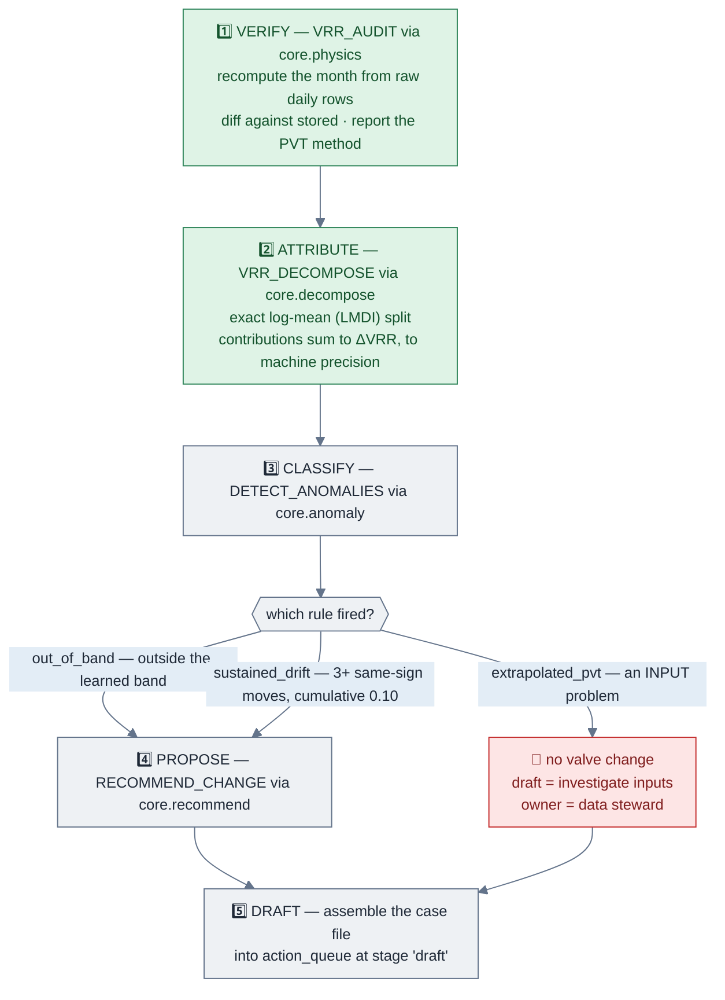

### How a recommendation gets its magnitude

```mermaid
%%{init: {'theme':'base','themeVariables':{'fontFamily':'ui-sans-serif, system-ui, -apple-system, sans-serif','fontSize':'13px','lineColor':'#64748b','primaryColor':'#eef1f4','primaryTextColor':'#1f2937','primaryBorderColor':'#64748b','secondaryColor':'#e3edf6','tertiaryColor':'#eef1f4'},'flowchart':{'htmlLabels':true,'padding':10,'nodeSpacing':46,'rankSpacing':54,'curve':'basis','useMaxWidth':true},'sequence':{'useMaxWidth':true,'boxMargin':8}}}%%
flowchart LR
    A["target VRR minus current VRR"] --> B["1. physics<br/>injection reservoir bbl needed"]
    B --> C["2. precedent calibration<br/>divide by rho, the learned per-pattern gain"]
    C --> D["3. allocate across injectors<br/>by current contribution"]
    D --> E["4. SAFETY CLAMP — each injector limited to<br/>safety_limits.max_inj_rate_change_pct"]
    E --> F["5. expected post-VRR<br/>current + rho · applied / production"]
    F --> G{{"was anything clamped?"}}
    G -->|"yes"| H["note: clamped by safety limits —<br/>expected VRR will not fully reach target"]

    classDef bad fill:#fde5e5,stroke:#c53030,stroke-width:1px,color:#7f1d1d;
    classDef ok fill:#dff3e6,stroke:#2f855a,stroke-width:1px,color:#14532d;
    class E bad;
    class C ok;
```

The model never picks the number **and never sees a path where it could** — step 4 is a
`min`/`max` in Python against a row in `vrr_agent.safety_limits`.

---

## 7. The faithfulness gate — what actually blocks a wrong answer

`core/faithfulness.py`. Pure, no second model, no I/O — it checks narration against the
decomposition that produced it.

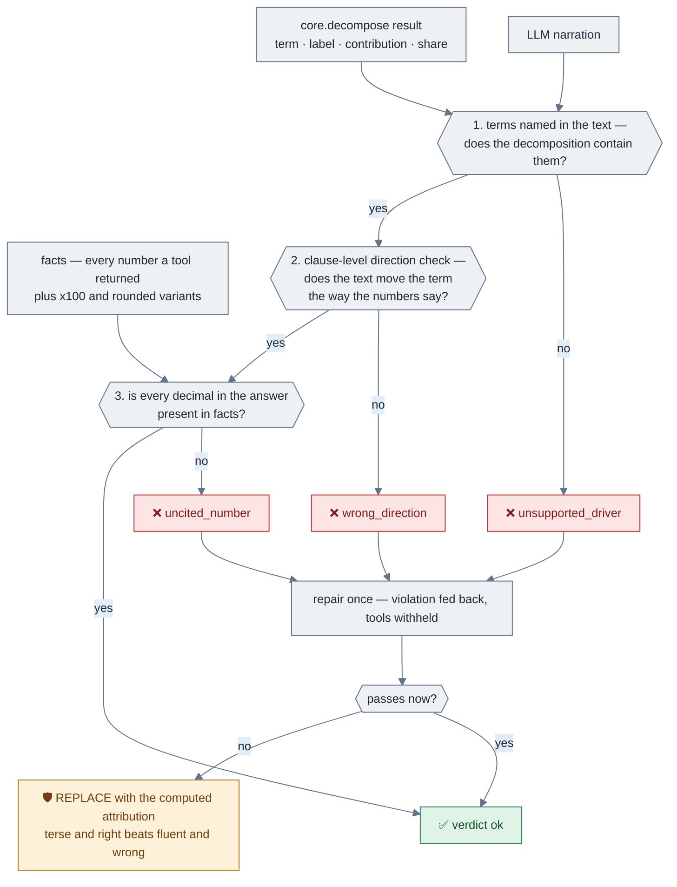

Two details that took real work:

- **Clause-level, not sentence-level.** *"water injection fell, pushing VRR up"* carries
  two opposite direction words; only the first is a claim *about the term*.
- **Listing is not claiming.** "gas injection contributed 0.0%" is fine; calling a 0.0%
  term *the driver* is not. `DRIVER_CLAIMS` phrases ("driven by", "main", "responsible
  for") turn a mention into a claim, and only terms above a 10% share may carry one.

Real output from a live run:

```
⚠️ The narration was rejected by the faithfulness gate.
Computed attribution:
- water production: +0.0294 VRR (59.6% of the move)
- oil production:   +0.0130 VRR (26.3% of the move)
- water injection:  -0.0069 VRR (14.1% of the move)
[gate: uncited_numbers: [3.36] | retried: True]
```

The model cited **3.36** — a number no tool returned. Caught, retried, replaced.

---

## 8. RAG — ingest, chunking, retrieval, and knowing when to abstain

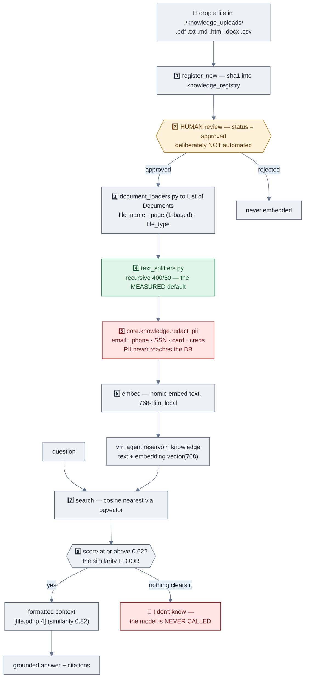

### Chunking is judged by retrieval, never by eye

Each chunk is embedded in **isolation** — context lost at a boundary is unrecoverable at
query time. So the test is retrieval, not appearance (`make chunks`):

| Strategy | chunks | ends on a sentence | recall@2 | MRR |
|---|---|---|---|---|
| fixed (200 chars) | 4 | 25% | 0.33 | 0.56 |
| **recursive (400/60)** ← default | 3 | 100% | **1.00** | **1.00** |
| semantic (cosine 0.75) | 9 | 100% | 0.67 | 0.78 |

Fixed splitting cuts `"…the response factor rho … It starts │ at 0.85…"`; the question
*"what does rho start at?"* then ranks the chunk holding `0.85` **third** — outside the
top-k that reaches the prompt.

**Semantic chunking is not automatically better.** On short, dense procedure text it
over-splits (83-char chunks carry too little context to rank). That finding is exactly
why the measurement exists.

Diagnosing a failing probe:

| Symptom | Cause | Fix |
|---|---|---|
| recall high, MRR low | chunks too big, answer buried | smaller chunks / more overlap |
| fails at one chunk size | a boundary cuts the rule | recursive, or raise overlap |
| **fails at every size** | vocabulary mismatch | query expansion / hybrid search |
| off-topic scores like answerable | wrong embedder for the domain | `make floor` shows a gap ≤ 0 |

### The floor is measured, not guessed

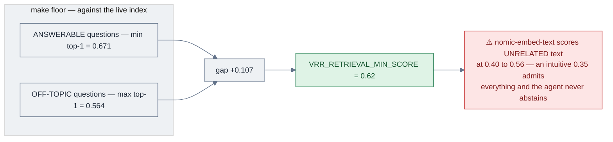

A **negative** gap means no threshold separates the sets — that is a retrieval problem
(chunking, embedder), not a tuning problem. `rulebook_unanswerable` in the eval set
guards the abstain path: without a negative case, a retriever that always returns its k
nearest rows scores identically to one that knows when it has nothing.

---

## 9. The closed loop — approval, execution, and learned ρ

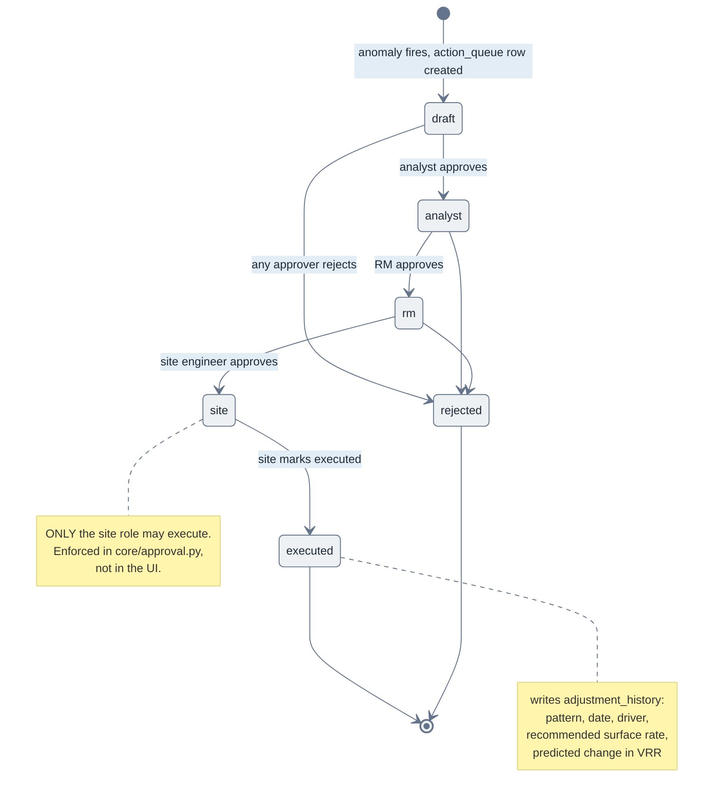

Then the loop closes:


`make writeback` (`pipeline/outcome_writeback.py`) is the job that closes this loop:
it copies the next monthly curated VRR onto `adjustment_history.actual_post_vrr` and
EMA-updates the response factor (ρ). Re-running is a no-op once the observed VRR is
filled; a pattern with no later curated period is left alone and ρ does not move.

---

## 10. Evaluation — prompts, traces, scorers, judges

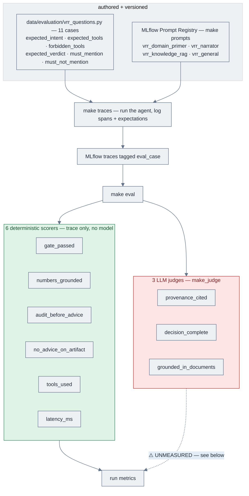

### The scorers, and what each one catches

| Scorer | Fails when | Latest run |
|---|---|---|
| `gate_passed` | any span records a faithfulness rejection | 1.00 |
| `numbers_grounded` | a decimal in the answer appears in no tool span | 0.98 |
| `audit_before_advice` | a recommendation is issued before an input audit | 1.00 |
| `no_advice_on_artifact` | a change is proposed on a `DATA_ARTIFACT` verdict | 1.00 |
| `tools_used` | *(diagnostic)* zero means the model spoke alone | mean 4.34 |
| `latency_ms` | *(diagnostic)* quality gains that cost 10× stay visible | mean 1.12 s |

### The case set — 11 cases, including the negative ones

| Case | Guards |
|---|---|
| `explain_out_of_band` | the core verify → attribute → propose path |
| `audit_clean_number` | an audit question must not turn into advice |
| `suspect_inputs_no_advice` | **no recommendation on a `DATA_ARTIFACT` verdict** |
| `healthy_pattern_no_action` | a healthy pattern gets no change proposed |
| `lineage_derivation` · `completions_listing` · `portfolio_triage` · `data_quality_check` | routing + tool selection |
| `rulebook_step_limit` | RAG grounding: the answer stays inside the retrieved excerpts |
| `rulebook_unanswerable` | **the agent must ABSTAIN** |
| `general_concept` | theory answered, and labelled "not your data" |

### ⚠️ The judges were rewritten off the trace; verdicts are not yet re-measured

`{{ trace }}` put all three in MLflow's agentic mode: the judge was not handed the
answer and had to tool-call through the span tree. Neither qwen2.5:7b nor gpt-4o-mini
could finish that walk (the hosted model hit MLflow's 30-iteration cap).
`provenance_cited` and `decision_complete` now use `{{ outputs }}` (the final answer
text, standard non-agentic mode). `grounded_in_documents` still uses `{{ trace }}`
because it needs the retriever span. Treat all three as **unmeasured** until the next
`make traces && make eval`.

> **Repo rule:** where a judge and a deterministic scorer disagree, **the deterministic
> one is right.** `numbers_grounded` scores 0.98 over the same traces; the ~0.02 judge
> means are from the agentic-mode run and are not a quality bar.

> **Evaluation rule:** always `make traces` immediately before `make eval`, and only via
> the Makefile — `make eval` passes `--eval-only`, which filters `tags.eval_case != ''`.
> Running the script bare scores the last 50 traces of *any* origin, so the `*/mean`
> denominators shift and two runs stop being comparable.

---

## 11. Observability — the trace span tree

Every question is a span tree in MLflow. Span **types** matter: a `RETRIEVER` span
carrying `mlflow.entities.Document`s is what makes retrieval scorable at all — the same
content in a `TOOL` span is invisible to the retrieval scorers.

```
chat.respond ······················ AGENT
├── agent.tool_loop ··············· AGENT      (agentic mode only)
│   ├── node.plan ················· LLM        ← the model's turn
│   ├── node.tools ················ CHAIN
│   │   ├── tool_call VRR_AUDIT ··· TOOL       ← recompute from raw
│   │   └── tool_call VRR_DECOMPOSE TOOL       ← LMDI attribution
│   ├── node.plan ················· LLM
│   ├── node.gate ················· CHAIN      ← faithfulness verdict
│   └── node.repair ··············· LLM        (only when the gate rejects)
├── llm.chat ······················ LLM        (default mode: rewrite only)
├── search_knowledge ·············· RETRIEVER  ← Documents, not a dict
└── faithfulness_gate ············· CHAIN
```

Tool spans are recorded **structured and untruncated** — a truncated payload silently
breaks every grounding check that reads the trace, which is a bug this repo has already
had once.

---

## 12. Governance — Unity Catalog as catalog-of-record

Unity Catalog OSS is a **catalog**, not a query engine. It governs registered assets
(RBAC + lineage + credential vending) but does **not** intercept live PostgreSQL queries
in OSS — Lakehouse Federation is Databricks-only.

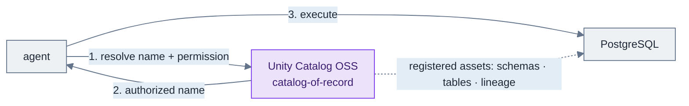

So the enforcement boundary is the agent, not the database. Full reasoning and the
alternative all-Delta design: [docs/design.md](docs/design.md).

---

## 12b. The workbench — React over FastAPI

Streamlit was retired in favour of a real client/server split. The reason is not
cosmetic: in the Streamlit version the approval role check was *hiding a button*, which
is UX, not a control. Now the client asks and the **server decides**.

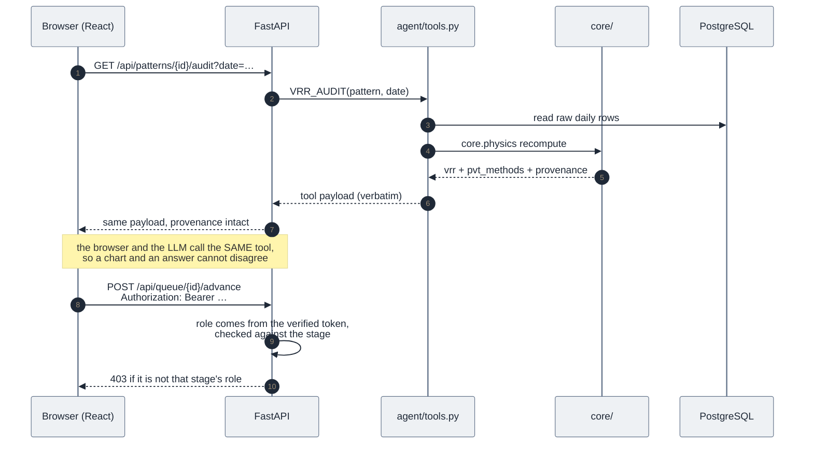

**The endpoints** (full OpenAPI at `:8000/docs`):

| Group | Endpoints |
|---|---|
| Reads | `/patterns` · `/overview` · `/data-quality` · `/input-audit` · `/patterns/{id}/context` `/trend` `/decompose` `/audit` `/lineage` `/completions` `/analysis` |
| Writes | `/patterns/{id}/submit` · `/queue/{id}/advance` · `/queue/{id}/reject` |
| Chat | `POST /chat` · `GET /chat/history` |
| System | `/health` · `/stages` · `/queue` · `/adjustments` |

**Three rules this layer holds:**

1. **No endpoint computes.** Reads are pass-throughs to `agent/tools.py`, provenance keys
   and all. A test asserts the payload comes back *verbatim* — the moment the API
   reshapes a tool result, the number on screen stops being the number the tool produced.
2. **Guardrails are server-side.** Role checks, terminal-stage refusals and the
   adjustment-history write all live in `routes_approvals.py`, and the role they check
   is the one in the caller's verified token — see [§12c](#12c-authentication--oauth2-password-grant--jwt-bearer).
3. **`adjustment_history` is written before the stage moves.** An executed item with no
   history row would silently never be learned from by the ρ loop.

**Why plain JSON and not token streaming:** `core.faithfulness` can only verify a
*finished* answer. Streaming tokens would mean streaming text the gate has not approved
and may replace. Streaming *progress events* (which tool is running) is the sane future
addition; streaming the narration is not.

The React side is deliberately thin — `web/src/api.ts` is the only place it speaks HTTP,
and no view does arithmetic. It renders what the tools computed, plus the provenance
caption under every answer:

```
Computed from your tables · qwen2.5:7b phrasing · ✅ gate passed after one repair
▸ Evidence & provenance
```

---

## 12c. Authentication — OAuth2 password grant + JWT bearer

The approval chain is a chain of *people*: a draft moves analyst → RM → site, and only
the site engineer may execute. That only means something if the server — not the client
— decides who you are. So **identity is a signed token claim**, established at login and
verified on every protected call.

### Signing in

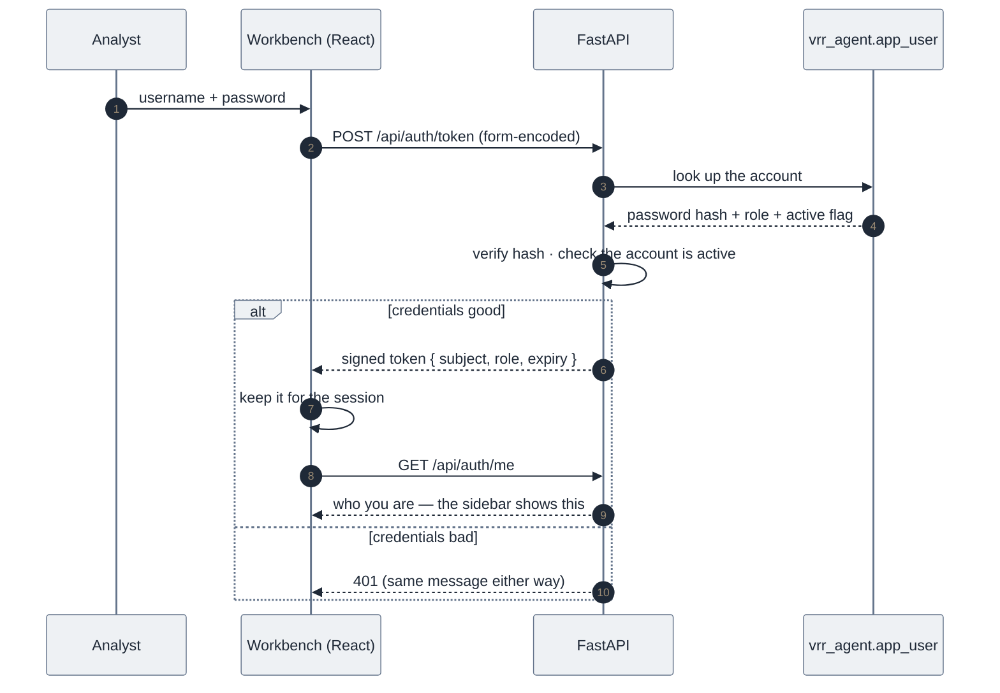

The failure message is identical whether the account does not exist or the password is
wrong: a login that distinguishes them tells a stranger which usernames are real.

### Making a request

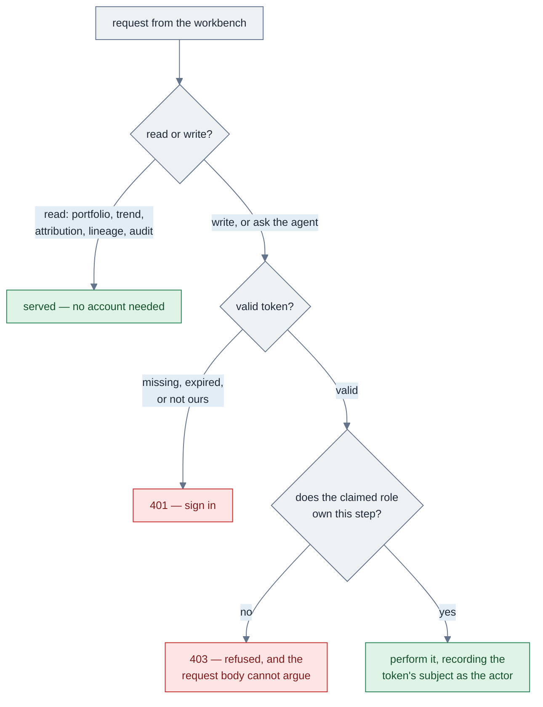

Two things fall out of that shape:

- **The role is never read from the request.** It is a claim inside the token, checked
  against the stage the item currently sits at. Hiding a button in the UI is convenience;
  the refusal is the control.
- **The actor on the audit trail is the token's subject.** `action_queue.stage_by` and
  `adjustment_history.approved_by` record who the server authenticated — the ρ learning
  loop and any later review read a name that was proven, not typed.

### What needs an account

| | Needs a token | Why |
|---|---|---|
| Portfolio, trend, attribution, lineage, audit, health | no | reading is how you evaluate the tool; a fresh clone should just work |
| Ask the agent (`/chat`) | **yes** | it spends real compute |
| Draft a change, advance, reject | **yes** | these move a valve change toward execution |

### Roles

```mermaid
%%{init: {'theme':'base','themeVariables':{'fontFamily':'ui-sans-serif, system-ui, -apple-system, sans-serif','fontSize':'13px','lineColor':'#64748b','primaryColor':'#eef1f4','primaryTextColor':'#1f2937','primaryBorderColor':'#64748b','secondaryColor':'#e3edf6','tertiaryColor':'#eef1f4'},'flowchart':{'htmlLabels':true,'padding':10,'nodeSpacing':46,'rankSpacing':54,'curve':'basis','useMaxWidth':true},'sequence':{'useMaxWidth':true,'boxMargin':8}}}%%
stateDiagram-v2
    [*] --> draft: agent raises it
    draft --> analyst: analyst signs off
    analyst --> rm: RM signs off
    rm --> site: site signs off
    site --> executed: site executes
    executed --> [*]

    note right of site
        Each arrow needs an account
        holding THAT role. Signing in
        as one role cannot perform
        another role's step.
    end note
```

### Setting it up

```bash
make users                          # creates the account table and seeds one demo
                                    # account per role, with hashed passwords
make users p=<your-password>        # …choosing the password instead of the default
```

Set a signing key in `.env` before real use — without one the API generates a throwaway
key per process, so sessions end at every restart and it says so loudly at startup:

```bash
python3 -c "import secrets; print(secrets.token_urlsafe(48))"   # → VRR_JWT_SECRET in .env
```

`.env` is gitignored. No credential or key is committed, and none has a default baked
into the source — a well-known signing key in a public repo would look like security
while providing none.

### Before exposing this beyond localhost

The defaults suit a workbench you run on your own machine. Moving it anywhere shared is
a deliberate step with a checklist, not a copy of this configuration:

1. **Change the seeded accounts** — `make users p=…`, or create real ones and remove the
   demos. Treat the shipped defaults as placeholders, not accounts.
2. **Set `VRR_JWT_SECRET`** to a value generated as above, hold it like a password, and
   rotate it if it is ever shared. Rotating invalidates existing sessions by design.
3. **Terminate TLS in front of the API.** Bearer tokens over plain HTTP are readable in
   transit; nothing in the application layer compensates for that.
4. **Shorten `VRR_JWT_TTL_MINUTES`** from the 12-hour default to match how long a session
   should reasonably live, since sessions end by expiry rather than by revocation.
5. **Decide where the token lives.** The browser build keeps it in web storage, which is
   the usual trade for a single-page app; a deployment with stricter requirements should
   move it to an httpOnly cookie and add CSRF protection.
6. **Point at your identity provider** if you have one. The verification step is one
   function — `current_user` in `api/auth.py` — and swapping local signing for an IdP's
   published keys changes nothing downstream of it.

`tests/test_auth.py` covers this layer as a set of adversarial cases — tampered tokens,
expired tokens, missing claims, and a caller trying to act above its role — so a
regression in any of them fails the suite rather than reaching a review.

---

## 12d. Sharing the workbench publicly — `make share`

This app was built to run on one laptop, and **two of its defaults are wrong the moment
a tunnel is pointed at it**:

- **Reads are unauthenticated.** `/api/patterns`, `/api/overview` and every trend,
  lineage and audit endpoint answer `200` to anybody. Locally that is convenience; on a
  public URL it is the whole dataset, served to whoever has the link.
- **`/api/health` reports internal addresses** — the Postgres host and the MLflow URI.
  Sidebar detail on a laptop, reconnaissance from a stranger's browser.

`VRR_SHARE=1` switches to a public posture: reads require a bearer token, health stops
naming hosts, the tunnel origin is accepted by CORS, and a missing `VRR_JWT_SECRET`
becomes a **startup error** rather than a warning — an ephemeral signing key on a shared
instance mints tokens that die at the next restart, which reads as a broken login.

```bash
ngrok config add-authtoken <YOUR_TOKEN>   # once — free account at dashboard.ngrok.com

VRR_SHARE=1 make app                      # terminal A — visitors must sign in to read
make share                                # terminal B — preflights, then opens the tunnel
```

To let people browse without an account — right for a demo over synthetic data, wrong
for anything else:

```bash
VRR_SHARE=1 VRR_PUBLIC_READS=1 make app   # reads open; writes and chat still need a token
```

`VRR_PUBLIC_READS` is a **second, deliberate decision**. Turning sharing on must only
ever tighten things, so it is never implied by `VRR_SHARE`.

| | reads | writes | chat | `/api/health` |
|---|---|---|---|---|
| local (default) | open | token | token | full |
| `VRR_SHARE=1` | **token** | token | token | redacted |
| `+ VRR_PUBLIC_READS=1` | open | token | token | redacted |

`make share` preflights rather than assuming: ngrok installed, authtoken configured,
`VRR_JWT_SECRET` present in `.env`, something serving on `:8000`, and **that the running
server actually has share mode on**. That last check earns its place — env is read once
at import, so tunnelling to an already-running plain server would silently expose
everything the flag was meant to close.

> **This is a demo posture, not a deployment.** It closes the obvious holes for an
> afternoon. TLS you terminate yourself, a real IdP, key rotation, rate limits and an
> audit sink are all still [§12c](#12c-authentication--oauth2-password-grant--jwt-bearer).
> The URL stays live for as long as ngrok runs — stop it when you are done.

Behaviour is covered by `tests/test_share.py` (10 cases) and was verified through a live
tunnel: anonymous read `401`, valid token `200`, forged token `401`, and with public
reads on, writes and chat still `401` while health stays redacted.

---

## 13. Run it

```bash
# ---- fast path: logic only, nothing running ---------------------------------
pip install -e ".[dev]"     # installable package + pytest/ruff
pytest -q                   # 129 tests, no Postgres, no Ollama, ~5 s

# ---- the stack --------------------------------------------------------------
docker compose up -d        # postgres+pgvector · unitycatalog · mlflow (host :5001)
make seed                   # synthetic VRR data; core.physics computes curated
make build                  # rebuild vrr_curated from vrr_raw alone
make queue                  # anomaly → action_queue drafts awaiting approval
make users                  # seed the demo accounts (analyst/rm/site) — writes need a token
make app                    # build the React UI and serve it from FastAPI on :8000

# ---- developing the UI ------------------------------------------------------
make api                    # FastAPI with --reload; OpenAPI docs at :8000/docs
make web                    # Vite dev server on :5173, proxying /api to :8000

# ---- knowledge / RAG --------------------------------------------------------
make knowledge              # register → (human approves) → load → chunk → embed
make loaders                # what a folder/URL parses into, before embedding it
make chunks                 # score chunking strategies by retrieval (recall@k, MRR)
make floor                  # measure the abstention threshold for YOUR corpus

# ---- the model --------------------------------------------------------------
make llm-check              # can each provider complete AND tool-call?
make agent                  # one question from the CLI, through the graph

# ---- evaluation (always in this order) --------------------------------------
make prompts                # version the 4 prompts in the MLflow registry
make traces                 # run the 11 eval cases, logging spans + expectations
make eval                   # score them (deterministic + judges if a model is up)
```

Every command commented step-by-step: [docs/running.md](docs/running.md).
Config lives in `.env` — copy [.env.example](.env.example), which documents every knob.

---

## 14. Repository layout

```
vrr_agent_open/
├── docker-compose.yml          # postgres+pgvector · unitycatalog · mlflow
├── Makefile                    # every target above; auto-selects .venv/bin/python
├── .env.example                # every setting, commented (keys live in .env only)
├── src/vrr_agent_open/
│   ├── config.py               # DSN · UC · MLflow · provider · embeddings · RAG floor
│   ├── core/                   # ⚙️ PURE logic — no I/O, unit-tested off-DB
│   │   ├── physics.py          #    PVT ladder + reservoir volumes
│   │   ├── decompose.py        #    exact LMDI ΔVRR attribution
│   │   ├── anomaly.py          #    out_of_band · sustained_drift · extrapolated_pvt
│   │   ├── recommend.py        #    rho-calibrated, safety-clamped change + EMA update
│   │   ├── audit.py            #    DATA_ARTIFACT vs REAL_SIGNAL verdict
│   │   ├── faithfulness.py     #    the gate: drivers · directions · numbers
│   │   ├── approval.py         #    draft → analyst → rm → site → executed
│   │   ├── knowledge.py        #    chunking + PII redaction
│   │   └── ids.py              #    stable short ids for provenance
│   ├── agent/
│   │   ├── graph.py            # 🧠 LangGraph StateGraph (plan/tools/gate/repair/budget)
│   │   ├── tools.py            #    16 deterministic tools over psycopg
│   │   ├── analyst.py          #    the 5-step pipeline
│   │   ├── chat.py             #    intent router + RAG + the abstain path
│   │   ├── llm.py              #    one call shape for every backend
│   │   ├── providers.py        #    ollama · openai · anthropic translation
│   │   ├── history.py          #    shared chat transcript in Postgres
│   │   └── tracing.py          #    MLflow spans (TOOL · LLM · CHAIN · RETRIEVER)
│   ├── pipeline/
│   │   ├── schema.sql          #    the three-schema DDL (+ pgvector)
│   │   ├── seed.py             #    deterministic synthetic field generator
│   │   ├── build.py            #    vrr_raw → vrr_curated via core.physics
│   │   ├── input_audit.py      #    the audit gate as a batch job
│   │   ├── anomaly_to_queue.py #    anomalies → action_queue drafts
│   │   ├── knowledge_ingest.py #    register → approve → load → chunk → embed → search
│   │   ├── document_loaders.py #    pdf/txt/md/html/docx/csv/folder/URL → Documents
│   │   └── text_splitters.py   #    fixed vs recursive vs semantic + retrieval_check
│   ├── evaluation/             # 6 deterministic scorers + 3 judges
│   ├── prompts/templates.py    # the 4 versioned prompts
│   ├── api/                    # 🌐 FastAPI — the workbench backend
│   │   ├── main.py             #    app, CORS, health, serves web/dist in prod
│   │   ├── routes_patterns.py  #    reads: overview · trend · decompose · audit · lineage
│   │   ├── routes_approvals.py #    the chain — ROLE CHECKS ENFORCED SERVER-SIDE
│   │   └── routes_chat.py      #    one gated answer per request + the transcript
│   └── governance/uc_register.py
├── web/                        # ⚛️ React + Vite + TypeScript + Tailwind
│   ├── src/api.ts              #    the typed client — the only place it calls HTTP
│   ├── src/App.tsx             #    shell: sidebar filters + view routing
│   ├── src/views/              #    Portfolio · Report · Lineage · Approval
│   └── src/components/         #    ChatDrawer + shared primitives
├── data/evaluation/            # the 11 authored cases + their expectations
├── scripts/                    # traces · eval · prompts · judges · floor · llm-check
├── tests/                      # 129 tests, all off-DB
└── docs/                       # design · running · agent-flow · knowledge-flow ·
                                # evaluation · evaluation-walkthrough · vrr_data_model
```

---

## 15. Status — what is real, and what is not

| Area | State |
|---|---|
| Deterministic core (`core/`) | ✅ ported verbatim, 129 tests, no stack needed |
| Postgres schema + seed + build | ✅ verified end to end (272,880 contrib → 1,440 monthly rows) |
| LangGraph agent + 15 tools | ✅ a real `StateGraph`; every path tested with the model stubbed |
| Faithfulness gate | ✅ catches wrong drivers, wrong directions, uncited numbers |
| React workbench + FastAPI | ✅ 4 views, docked chat, login, **roles from signed JWT claims** (403/401-verified live) |
| RAG (load → chunk → embed → search) | ✅ 4 docs / 35 chunks ingested; chunking + floor both **measured** |
| Abstention ("I don't know") | ✅ floor 0.62, model not called, guarded by an eval case |
| Providers (Ollama / OpenAI / Anthropic) | 🔶 local verified; **hosted unverified — no API key on the dev machine** |
| Evaluation harness | ✅ 6 deterministic scorers over 11 cases |
| The 3 LLM judges | 🔶 `provenance_cited` / `decision_complete` now read `{{ outputs }}`; `grounded_in_documents` still walks `{{ trace }}`. Verdicts not re-measured; deterministic scorers win. |
| ρ write-back loop | ✅ `make writeback` fills `actual_post_vrr` from the next monthly VRR and EMA-updates ρ into `pattern_memory` |
| Unity Catalog registration | 🔶 skeleton; column population from `information_schema` is a TODO |
| GitHub Actions (`make test`) | ✅ `.github/workflows/test.yml` — off-database unit tests on pull requests and pushes to `main` |
| Docker compose path | 🔶 MLflow host port is `5001:5000` (macOS AirPlay holds 5000); stack not yet verified end-to-end |

Contributions welcome — Apache-2.0.
