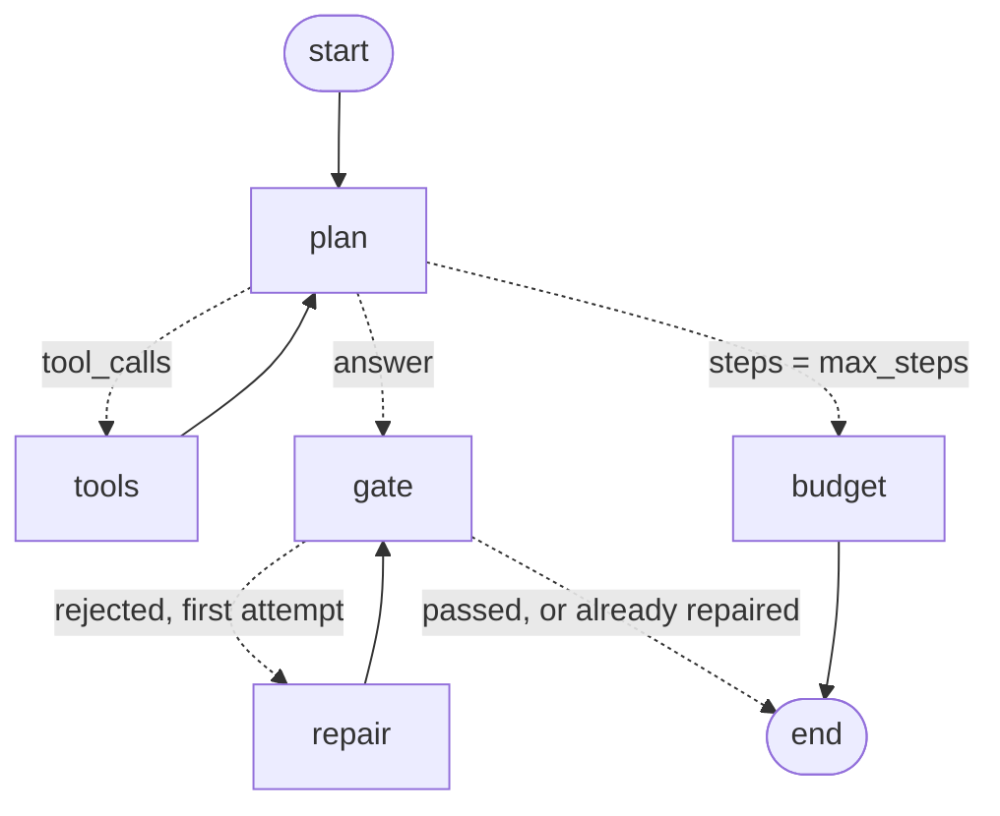

# Analyst workflow — from a suspicious number to an approved valve change

How the workbench views, the always-present chat, the agent, and the deterministic core
fit together. The UI is React (`web/`) over FastAPI (`api/`); Streamlit was retired on
2026-07-30. Companion to [design.md](design.md) (why) and [running.md](running.md)
(commands).

## The loop

```
      ┌──────────── React workbench (make app) ─────────────────┐
      │ 🗺️ Portfolio   every pattern vs target, ranked by drift  │
      │ 📈 Report      trend + band + ΔVRR attribution + draft   │
      │ 🔎 Lineage     raw → PVT → contrib → monthly + RECOMPUTE │
      │ ✅ Approval    draft → analyst → RM → site → executed    │
      ├─────────────────────────────────────────────────────────┤
      │ 💬 Chat — a drawer docked RIGHT of every view, collapsible│
      │    with 💬/✕; carries the sidebar's pattern + period, and │
      │    its transcript persists in vrr_agent.chat_history     │
      └────────────────────────┬────────────────────────────────┘
                               │ every number
      ┌────────────────────────▼────────────────────────────────┐
      │ api/ — FastAPI: 20 endpoints, role checks enforced HERE  │
      ├─────────────────────────────────────────────────────────┤
      │ agent/tools.py — deterministic tools over PostgreSQL     │
      │ core/physics · decompose · anomaly · recommend · approval│
      └──────────────────────────────────────────────────────────┘
```

The LLM sits *outside* that box. It may pick tools and rephrase the computed answer;
it may never produce a figure. `core/faithfulness.py` enforces that before an answer
reaches the analyst.

## What the agent does when you ask "why is VRR high?"

`agent/analyst.py::analyze` runs five steps in this order — the order is the point:

| # | Step | Code | Question it answers |
|---|------|------|---------------------|
| 1 | **Verify** | `VRR_AUDIT` → `core.physics` | Is the number even right? Recomputes the month from raw and diffs it against the stored value; reports the PVT method. |
| 2 | **Attribute** | `VRR_DECOMPOSE` → `core.decompose` | Which term moved it? Exact log-mean (LMDI) split; Σ contributions = ΔVRR. |
| 3 | **Classify** | `DETECT_ANOMALIES` → `core.anomaly` | Out of band? Sustained drift? Suspect inputs? |
| 4 | **Propose** | `RECOMMEND_CHANGE` → `core.recommend` | How much valve change, ρ-calibrated and clamped by `vrr_agent.safety_limits`. |
| 5 | **Draft** | `core.anomaly.build_draft` | A queue row citing anomaly + recommendation + precedent. |

Step 1 gates step 4: if the PVT lookups were extrapolated, the draft becomes
*investigate inputs* and no valve change is proposed (design §6 — never act on suspect
inputs).

## Connecting the local LLM

```bash
brew install ollama                # or https://ollama.com/download
ollama serve &                     # http://localhost:11434
ollama pull qwen2.5:7b             # narrator + tool-caller (reliable tool schema)
ollama pull nomic-embed-text       # 768-dim embeddings for knowledge search
```

The workbench auto-detects it via `/api/health` (the sidebar flips to 🟢 with the model
name). `VRR_LLM_MODEL`
overrides the choice; `agent.llm.pick_model()` falls back to whatever chat model is
actually pulled, so any local model works. `VRR_LLM_BASE_URL` points at any other
OpenAI-compatible endpoint.

Two modes, toggled beside the chat header:

| Mode | Who calls the tools | Speed (local 7B) | Use when |
|---|---|---|---|
| **default** | the deterministic pipeline (`analyst.analyze`) runs verify → attribute → classify → propose; the model only rewrites the result | ~8 s | normal analysis |
| **agentic** | the model itself picks tools/tables in a loop (`graph.run`) | ~1–2 min | open-ended questions that cross tools |

Both are gated identically. In practice the agentic loop on a 7B model gets caught
fabricating figures more often (it likes to compute daily averages) — when that happens
the computed answer is shown with the violation displayed, which is the designed
outcome, not a failure.

### The agentic mode is a LangGraph `StateGraph`

`agent/graph.py` compiles this once per process (`graph.GRAPH`; `build()` returns an
uncompiled copy for inspection — `build().get_graph().draw_mermaid()`):



| Node | Does | May speak |
|---|---|---|
| `plan` | the model picks a tool from the 15 specs, or answers | ✅ (the only one) |
| `tools` | runs them over Postgres, harvests every returned number into `facts` | ❌ |
| `gate` | `core.faithfulness` — drivers must match the decomposition, numbers must be in `facts` | ❌ |
| `repair` | one rewrite with the violation fed back, **tools withheld** | ✅ |
| `budget` | terminal when `max_steps` model turns are spent | ❌ |

What the framework buys over the hand-rolled loop it replaced:

- **The state schema is the contract.** `messages`, `trace`, and `facts` use
  `Annotated[list, operator.add]`, so a node returns only what it *adds*. No step can
  drop evidence the gate is about to check.
- **The gate is an edge, not a convention.** Every path from `plan` to `END` runs
  through `gate`, including the repaired text (`repair → gate`, not `repair → END`).
- **Runs are resumable.** The graph compiles with an `InMemorySaver`, so
  `run(..., thread_id="x")` continues that conversation with its messages and evidence
  intact instead of restarting.
- **The topology is testable.** `tests/test_graph.py` asserts the edges and every path
  through them — repair-once, budget exhaustion, resume — with the model and the
  database both stubbed, so it runs in the off-DB `pytest -q` tier.

`max_steps` (default 6) counts model turns; `recursion_limit` sits above it as a
backstop, since one turn can fan out to tools and back.

## General VRR questions

Conceptual questions ("what is VRR", "what happens if you over-inject") are routed to a
`general` intent: the model answers from its own knowledge, grounded in the project's
VRR primer (`graph.DOMAIN`) plus any ingested documents (pgvector), and the answer is
labelled *general knowledge — not computed from your Postgres tables*. Nothing about
this field's numbers may come from that path.

## The chat is answerable without an LLM

`agent/chat.py` routes a question to an intent (`status` · `help` · `explain` · `audit` ·
`lineage` · `recommend` · `submit` · `knowledge` · `list`), resolves the pattern/date from
the text or the sidebar selection, and builds the answer from tool output. `status` and
`help` are written/probed, never generated — "which model?" must not fall through to the
narrator. Then:

* **No local LLM running** → the computed narrative is shown as-is. Nothing is lost but
  the prose.
* **Ollama running** → the LLM rewrites that narrative, and the result must pass
  `check_faithfulness` (no unsupported driver, no wrong direction) *and* `check_numbers`
  (every decimal in the text must match a tool-produced figure). On failure the computed
  text is shown instead, with the violation displayed.

## Two data sources the chat can query

| Source | Tool | What it answers |
|---|---|---|
| **Postgres relational** (`vrr_raw`, `vrr_curated`, `vrr_agent`) | `VRR_GET`, `VRR_TREND`, `VRR_DECOMPOSE`, `VRR_LINEAGE`, `VRR_AUDIT`, `PATTERN_CONTEXT`, `DETECT_ANOMALIES`, `RECOMMEND_CHANGE`, `FIND_PRECEDENT`, `SUBMIT_FOR_APPROVAL` | anything about *your* numbers |
| **Postgres pgvector** (`vrr_agent.reservoir_knowledge`) | `SEARCH_KNOWLEDGE` | what your ingested documents say |

The `knowledge` intent is RAG: the query is embedded locally (`nomic-embed-text`), the
nearest chunks come back from `embedding <=> query` (cosine), and the model may only
summarise **those excerpts** — it is instructed to say "not in the documents" rather
than answer from its own knowledge, and every answer cites file + page.

### Steps: load documents into pgvector

```bash
ollama pull nomic-embed-text                     # 768-dim embeddings, local
mkdir -p knowledge_uploads && cp <your.pdf> knowledge_uploads/
make knowledge                                   # 1. REGISTER → status pending_review
psql "$VRR_PG_DSN" -c "UPDATE vrr_agent.knowledge_registry \
      SET status='approved', reviewed_by='<you>' WHERE file_name='<your.pdf>'"   # 2. HUMAN review
make knowledge                                   # 3. chunk → PII-redact → embed → store
```

Step 2 is deliberately manual: only a human decides a document is VRR-relevant and fit
to embed (guardrail in [knowledge-flow.md](knowledge-flow.md)). PII is redacted before
embedding, so it never reaches the index. Then ask in the chat: *"What do the
documents say about changing injection rates?"*

Requires the `vector` extension in Postgres (the compose image has it; a bare local
Postgres needs `brew install pgvector` + `CREATE EXTENSION vector`).

### Steps: add your own tool

1. **Write the function** in [`agent/tools.py`](../src/vrr_agent_open/agent/tools.py).
   Take plain args, return a JSON-serialisable dict, and include a `provenance` key
   naming the table(s) it read:
   ```python
   def injector_pressure(pattern: str, date: str) -> dict:
       rows = _rows("SELECT ... FROM vrr_raw.pattern_pressure WHERE ...",
                    {"p": pattern, "d": date})
       return {"rows": rows, "provenance": {"table": "vrr_raw.pattern_pressure"}}
   ```
2. **Declare it** to the model in `TOOL_SPECS` via the `_spec(...)` helper — name in
   CAPS, one-line description, JSON-schema parameters.
3. **Dispatch it** in `DISPATCH`: `"INJECTOR_PRESSURE": lambda a: injector_pressure(a["pattern"], a["date"])`.
4. **(Optional) route it deterministically** — add keywords to `INTENTS` in
   [`agent/chat.py`](../src/vrr_agent_open/agent/chat.py) if you want the tool used
   without waiting for the model to choose it.
5. **Mention it in the primer** (`DOMAIN` in `agent/graph.py`) if the model needs to
   know when to reach for it.

Nothing else changes: the agentic loop picks it up automatically, errors are returned as
`{"error": ...}` rather than crashing the loop, and any number it returns is added to
the whitelist the faithfulness gate checks the narration against.

## Seeing what the agent did — MLflow traces

Every question is recorded as a span tree, so you can see which tools ran, in what
order, how long each took, what the LLM was sent, and what the gate decided.

```bash
# 5000 is taken by AirPlay Receiver on macOS — use 5001 (or disable the receiver)
mlflow server --backend-store-uri sqlite:///mlflow.db --host 127.0.0.1 --port 5001
export MLFLOW_TRACKING_URI=http://localhost:5001
make app        # or the docker-compose mlflow service on host :5001 (5001:5000)
```

Open <http://localhost:5001> → experiment **vrr-agent-open** → *Traces*. The sidebar in
the app links straight to it and shows whether tracing is live.

Typical trees:

```
chat.respond (AGENT)  9.9 s          chat.respond (AGENT)  43 ms
 ├ analyst.analyze (CHAIN)            ├ VRR_AUDIT (TOOL)
 │  ├ VRR_AUDIT (TOOL)                └ VRR_GET   (TOOL)
 │  ├ VRR_DECOMPOSE (TOOL)
 │  └ RECOMMEND_CHANGE (TOOL)        agent.tool_loop (AGENT)   ← agentic mode
 └ llm.chat (LLM)                     ├ llm.chat (LLM)
                                      ├ tool_call (TOOL) ×N
                                      └ faithfulness_gate (CHAIN)
```

`agent/tracing.py` probes the tracking server **once at import** (0.7 s) and falls back
to a no-op decorator — so a missing MLflow install or a dead server costs nothing and
prints nothing. Force it off with `VRR_TRACING=0`; rename the experiment with
`VRR_MLFLOW_EXPERIMENT`.

## Lineage — what is actually stored

`vrr_curated.completion_contrib` is the lineage layer: one row per
(pattern, completion, **day**) carrying the root inputs (`factor, oil, water, gas,
water_inj, gas_inj`), the pattern pressure used, the **PVT method label**
(`exact | interpolated | extrapolated | closest | none`), all five derived reservoir
terms, and the `run_id` of the build that produced it. So for any VRR on screen you can
walk down to the exact daily rows and the exact FVF lookup behind it — that is what the
🔎 Lineage tab and `VRR_LINEAGE` render, and what `VRR_AUDIT` independently recomputes.

Unity Catalog OSS (`make register`) records the same chain at *table* level (raw →
curated → agent) for governance; the row-level derivation lives in the contrib table.

## Approval

`core/approval.py` owns the state machine: `draft → analyst → rm → site → executed`,
plus `rejected` from any live stage. The agent may only write `draft` — every forward
transition is a human act in the app, role-gated in the sidebar. Executing writes
`vrr_agent.adjustment_history` (predicted vs actual ΔVRR). After the next monthly
build, `make writeback` (`pipeline/outcome_writeback.py`) fills `actual_post_vrr` from
the earliest later `vrr_curated.pattern_vrr` and EMA-updates the response factor (ρ)
via `core.recommend.update_response_factor` into `pattern_memory`. No later period yet
is a no-op.

```bash
make queue       # anomaly → drafts for every pattern's latest period
make app         # review, chat, approve
make writeback   # after executed changes + the next build: observed VRR → ρ
```
