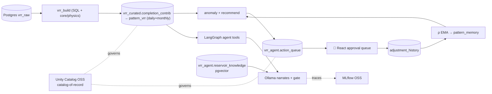
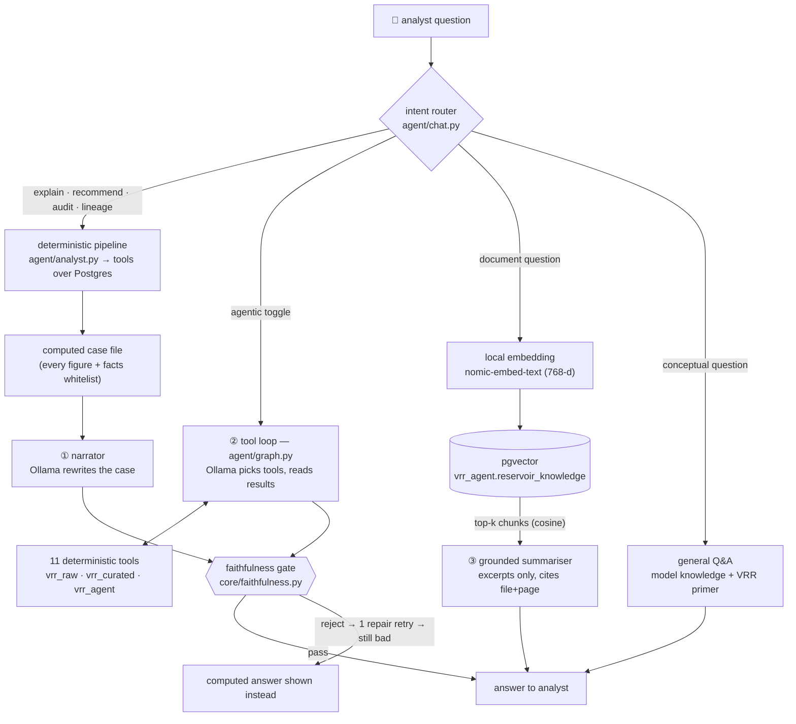

# vrr_agent_open — design & feasibility

Data model reference (production → local mapping): [vrr_data_model.md](vrr_data_model.md).

An **all open-source, all-local** port of the Databricks VRR Reasoning & Lineage agent.
Same trust model — *the LLM never computes; every number comes from a deterministic
tool with provenance; a faithfulness gate rejects unsupported narration; recommendations
are physics-computed and safety-clamped; humans approve; outcomes feed a learned ρ* —
rebuilt on a free, local stack.

## Component map (Databricks → OSS)

| Concern | Databricks | vrr_agent_open (OSS) |
|---|---|---|
| Data + compute | Spark / SQL warehouse | **PostgreSQL** (VRR is pure SQL) + psycopg |
| Governance | Unity Catalog (managed) | **Unity Catalog OSS** — catalog-of-record |
| Agent loop | Mosaic AI ChatAgent | **LangGraph** (tool nodes + gate node) |
| Tracing / eval / registry | MLflow (managed) | **MLflow OSS** (local server, Postgres backend) |
| Vector index | Vector Search | **pgvector** (same Postgres) |
| Serving | Model Serving endpoint | **FastAPI/LangServe** or in-process |
| UI | Databricks Apps | **React + Vite + TS** over **FastAPI** (local) |
| Packaging/deploy | DAB bundle | **docker-compose** + `pip install -e .` |
| LLM narrator | claude-sonnet-5 (in-workspace) | **Ollama** local (pluggable) |

## Feasibility: "Unity Catalog on top of PostgreSQL"

**Verdict: feasible as a *catalog-of-record*, not as a query-enforcement layer.**

Unity Catalog OSS (github.com/unitycatalog/unitycatalog, Apache-2.0) is a real,
runnable governance server — but it is a **catalog** (metadata + RBAC + lineage +
credential vending), **not a query engine**. Two consequences:

1. **It governs registered assets, it doesn't intercept Postgres queries.** Querying
   live Postgres *through* UC (Lakehouse Federation) is a Databricks-proprietary
   feature, absent from OSS. So UC OSS won't enforce row/column policy on a raw
   `psycopg` query.
2. **Its own metastore backend can be Postgres** — so the same Postgres instance
   holds both the VRR data *and* UC's catalog metadata.

**Design chosen:** Postgres is data + compute; UC OSS is the **catalog-of-record** —
it holds the governed schema/table/function inventory, RBAC grants, and lineage
metadata. The agent resolves object names + permission from UC, *then* executes
against Postgres. Governance = catalog + access decisions + lineage (auditable,
declarative — mirrors the Databricks "declared resources" model), just without
in-query enforcement. If you later want true enforcement, put a thin policy check
(read grants from UC) in the tools layer before each Postgres call.

Alternative (not chosen): all-Delta data governed natively by UC + DuckDB engine —
cleaner UC semantics but drops the "run VRR in Postgres" goal.

## What ports verbatim (provider-agnostic, already tested)

`core/physics.py`, `core/recommend.py`, `core/anomaly.py`, `core/knowledge.py`,
`core/approval.py` are pure Python with **no Databricks/Spark dependency** — copied
unchanged, with their unit tests. That's the deterministic heart of the system: PVT
ladder, ρ-calibrated safety-clamped recommendation, anomaly rules + input veto, PII
redaction, and the approval state machine. The only rewrites are the I/O edges:
tools over psycopg (was Spark), the LangGraph loop (was ChatAgent), and governance
registration (UC OSS REST, was DAB resources).

## Data flow (unchanged in spirit)

## LLM integration & RAG architecture

The local LLM (Ollama, pluggable via `VRR_LLM_BASE_URL`) is attached at **three** points,
and none of them is allowed to produce a number. Implementation walk-through:
[agent-flow.md](agent-flow.md); ingestion detail: [knowledge-flow.md](knowledge-flow.md).

**① Narrator (default).** The deterministic pipeline runs verify → attribute → classify
→ propose and hands the LLM a finished case file to phrase. Fast (~8 s on a local 7B)
and the model has no opportunity to choose the wrong table.

**② Tool loop (agentic mode).** The model plans tool calls itself against the three
schemas — this is where "the LLM reasons over the Postgres tables and the lineage
graph". Slower (~1–2 min locally) and it is the mode where a small model most often
gets caught fabricating figures.

**③ RAG over pgvector.** Document questions never touch the relational tools: the query
is embedded locally with `nomic-embed-text` (768-d, the same model used at ingest), the
nearest chunks come back from `embedding <=> query` in Postgres, and the model may
summarise **only those excerpts**, citing file + page. Ingestion is register → *human
approval* → chunk → PII-redact → embed, so unreviewed or PII-bearing text never enters
the index.

**The gate** applies to ① and ②, the two paths that speak about field data. It rejects a
driver the decomposition doesn't support, a direction it contradicts, and any decimal no
tool produced; one repair retry is allowed, then the computed answer is shown instead.
③ needs no gate — its claims are bounded by the retrieved text — and ④ (general Q&A) is
labelled as model knowledge, explicitly not computed from the tables.

Why an embedded local model rather than a served endpoint: the whole stack must run
offline and free. `agent/llm.py::pick_model` resolves whatever model is actually pulled,
so swapping `qwen2.5:7b` for a larger model (or a remote OpenAI-compatible endpoint) is
a config change, not a code change.

## Build order
1. `docker compose up -d` → Postgres+pgvector, Unity Catalog OSS, MLflow.
2. `make seed` → synthetic raw + curated (core/physics computes curated).
3. `make register` → schemas/tables in UC OSS.
4. `make test` → the ported pure-logic tests (no stack needed).
5. `make queue` → anomaly drafts into the action queue.
6. `make knowledge` → PDFs → pgvector (register → approve → embed).
7. `make agent` / `make app` → ask questions; approve drafts.

## Status
Deterministic core, seed + builder, agent (tools · analyst · chat · gate), pgvector RAG,
and the workbench (4 tabs + a right-docked analyst chat drawer with persistent history) are all implemented and verified against a live Postgres; 59
tests pass off-DB. Remaining: UC column-level registration, and a run of the whole
path on the docker-compose stack (so far verified on a local Postgres 18 + pgvector
0.8.5 cluster). The response factor (ρ) write-back is `make writeback`.
