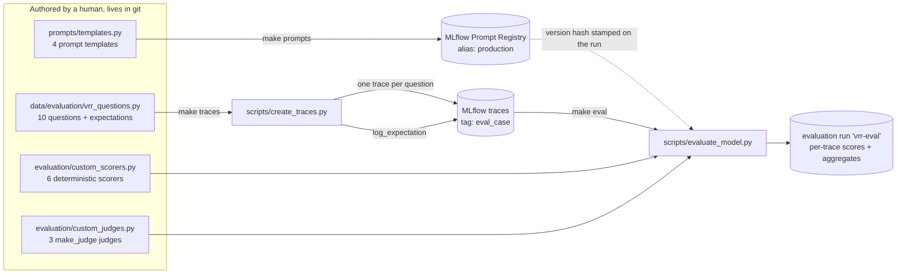
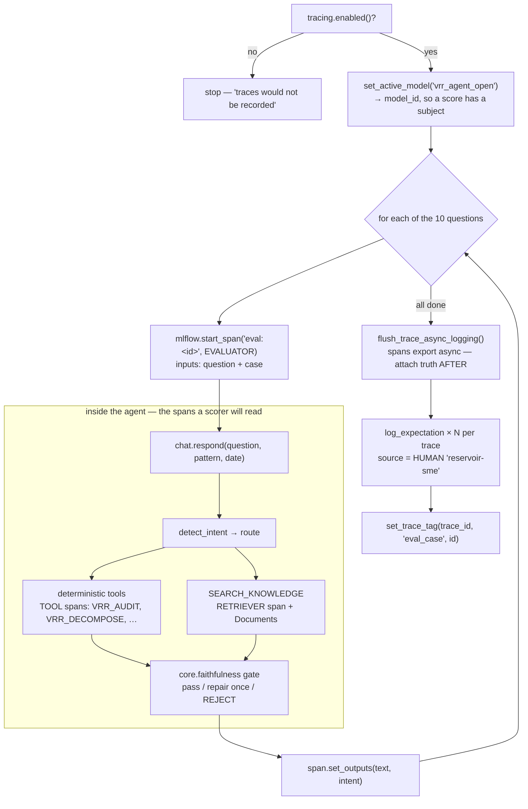
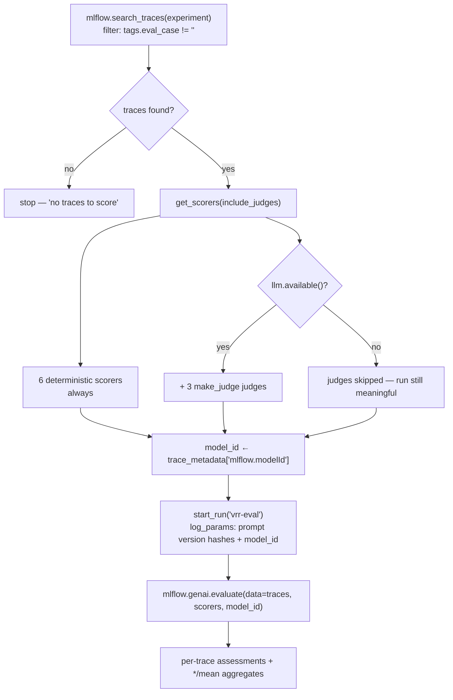

# Evaluating the agent — traces, expectations, scorers, judges

Tracing tells you *what the agent did*; evaluation tells you *whether it was any good*, and
whether today's build is better or worse than last week's. This is the MLflow GenAI
workflow — prompt registry, ground-truth expectations, deterministic scorers and LLM
judges over traces — wired to the local stack.

New here? [evaluation-walkthrough.md](evaluation-walkthrough.md) is the plain-English,
command-by-command version of this document, including how to read each score.

```
scripts/register_prompt.py    prompts/templates.py  →  MLflow Prompt Registry (alias: production)
scripts/create_traces.py      data/evaluation/      →  one trace + expectations per question
scripts/evaluate_model.py     traces + scorers      →  an evaluation run with per-trace scores
scripts/register_judge.py     evaluation/judges     →  server-side judges (optional auto-scoring)
```

```bash
make prompts     # version the four prompts, alias them "production"
make traces      # run the question set, attach ground truth
make eval        # score: deterministic scorers + judges if a model is reachable
```

## The flow, end to end

Three commands, and nothing hidden between them: the only thing `make traces` hands to
`make eval` is **traces in MLflow**. That is deliberate — evaluation reads the same
recording of the agent that a human debugging a bad answer would read, so a score can
never be computed from evidence the analyst can't also see.



### Stage 1 — `make traces`: record the agent answering, then staple the truth on

`create_traces.py` refuses to run if tracing is off, because a run with no traces looks
like a pass. Each question is wrapped in an `EVALUATOR` span so the question, the case id
and the final answer are all inside the same trace as the tool calls that produced it.



The expectations are the authored fields of the question entry — `expected_intent`,
`expected_tools`, `forbidden_tools`, `expected_verdict`, `must_mention`,
`must_not_mention` — logged against a **human** assessment source. The `eval_case` tag is
what `--eval-only` filters on later, and is the reason the Makefile rule exists.

### Stage 2 — `make eval`: select traces, assemble scorers, score



**This is why `make traces` must immediately precede `make eval`.** The filter selects by
tag, not by time; running `evaluate_model.py` bare drops the filter and scores the last 50
traces of *any* origin, which shifts every `*/mean` denominator and makes two `vrr-eval`
runs incomparable.

### What a scorer actually reads

Every deterministic scorer is a pure function of the span tree — no LLM, no network. A
real trace from the question set, and the facts each scorer extracts from it:

```
eval:explain_out_of_band                EVALUATOR   ─┐
└─ chat.respond                         AGENT        │ _final_answer() = root span's
   ├─ PATTERN_CONTEXT                   TOOL         │ output text — what the analyst read
   ├─ VRR_TREND                         TOOL         │
   ├─ VRR_AUDIT                         TOOL  ←──────┤ audit_before_advice: index of the
   ├─ VRR_DECOMPOSE                     TOOL         │ first AUDIT_TOOL must precede the
   ├─ RECOMMEND_CHANGE                  TOOL  ←──────┤ first ADVICE_TOOL, by start time
   └─ llm.chat                          LLM          │
                                                     │ numbers_grounded: every -?\d+\.\d+
eval:knowledge_lookup                   EVALUATOR    │ in the answer must appear in some
└─ chat.respond                         AGENT        │ TOOL or RETRIEVER span payload
   └─ SEARCH_KNOWLEDGE                  RETRIEVER ←──┘ (RETRIEVER counts — that's what
        outputs: 4 × Document{page_content, metadata{file_name, page, score}}   makes RAG
                                                                               scoreable)
```

`gate_passed` scans every span for a recorded gate rejection; `no_advice_on_artifact`
looks for a `DATA_ARTIFACT` verdict anywhere in the tree and then checks the answer
proposes nothing; `tools_used` and `latency_ms` are counts off the same structure. None of
them ask a model anything, which is why they are the tiebreaker when a judge disagrees.

## Two kinds of scorer, and why the split matters

**Deterministic scorers** ([`evaluation/custom_scorers.py`](../src/vrr_agent_open/evaluation/custom_scorers.py))
are facts about the span tree. No LLM, no endpoint, no cost, exact every time:

| Scorer | Question it answers |
|---|---|
| `gate_passed` | did the faithfulness gate accept the narration? |
| `numbers_grounded` | does every decimal in the answer exist in a tool span's output? |
| `audit_before_advice` | was the input audit consulted *before* a recommendation? |
| `no_advice_on_artifact` | did we refrain from proposing a change on suspect inputs? |
| `tools_used` | how many deterministic tools the answer rests on (0 = the model spoke alone) |
| `latency_ms` | so a quality gain that costs 10× is visible |

**LLM judges** ([`evaluation/custom_judges.py`](../src/vrr_agent_open/evaluation/custom_judges.py))
are for what needs language judgement — `provenance_cited`, `decision_complete`,
`grounded_in_documents` — built with `mlflow.genai.make_judge`, boolean-valued so they
aggregate into a pass rate. They do **not** all read the same thing: `provenance_cited`
and `decision_complete` inspect `{{ outputs }}` (the final answer text, MLflow's
standard non-agentic mode). `grounded_in_documents` still inspects `{{ trace }}` because
it needs the retriever span. Putting all three on `{{ trace }}` put them in agentic
trace-walking mode, which neither qwen2.5:7b nor gpt-4o-mini could complete.

The judge model is separate from the agent's narrator (`VRR_JUDGE_MODEL`), and reaches
Ollama through its OpenAI-compatible endpoint:

```bash
export OPENAI_API_BASE=http://localhost:11434/v1 OPENAI_API_KEY=ollama
export VRR_JUDGE_MODEL=openai:/qwen2.5:7b        # or a larger local model
```

**Judge reliability is the limiting factor.** On a local 7B the judges are useful for
*relative* movement between runs, not as an absolute bar. Treat all three as
UNMEASURED until the next `make traces && make eval` after this template split.
Where a judge and a deterministic scorer disagree, the deterministic scorer is right.
`scripts/run_memalign.py` is where judge alignment against human feedback belongs once
there is feedback to align on.

## Ground truth

[`data/evaluation/vrr_questions.py`](../data/evaluation/vrr_questions.py) holds ten analyst
questions with authored expectations — expected intent, tools that must appear, tools that
must *not*, the input-audit verdict for that period, and phrasing the answer must or must
not contain. They are logged onto each trace as MLflow expectations tagged to a human
source, so scorers compare against a reference rather than judging an answer on its own
terms.

The set covers the paths that matter, including the ones that should produce *no* advice:
the healthy control, and the suspect-PVT case where a recommendation would be a guardrail
breach.

## What the harness caught on its first run

Worth recording, because it is the argument for building it:

1. **Two routing gaps** — "which patterns are furthest from target" and "is the input data
   sane" both fell through to a pattern listing. `VRR_OVERVIEW` and `DATA_QUALITY` existed
   as tools but were unreachable from chat; there are now `portfolio` and `data_quality`
   intents.
2. **Truncated tool spans** — the tracing decorator stringified span outputs and cut them
   at 2000 characters, so an answer's figures often sat beyond the cut. Any trace-based
   grounding check was meaningless until spans carried structured, untruncated payloads.
3. **Two false-negative classes in the production gate** — `check_numbers` compared
   unsigned figures from the text against signed facts (so every negative contribution
   read as uncited), and had no allowance for presentation rounding (`0.56` shown as
   `0.6`). Both are now handled, with tests, and invention is still caught.
4. **A figure with no tool span behind it** — the drift total in the anomaly detail was
   computed by `core.anomaly` called directly from the analyst, bypassing the
   `DETECT_ANOMALIES` tool. Unauditable by construction; the analyst now classifies
   through the tool.

Grounding went 5/10 → 10/10 across those fixes, and three of the four were defects in the
system rather than in the measurement.

## Retriever spans

MLflow's retrieval scorers only see spans typed `RETRIEVER` carrying `Document` objects.
`SEARCH_KNOWLEDGE` emits those (`tracing.retriever_span`), which is what makes
`RetrievalGroundedness` / `RetrievalRelevance` / `RetrievalSufficiency` applicable to the
pgvector path at all — as a `TOOL` span it was invisible to them.

## Automatic (online) scoring

`Scorer.register()` puts a judge on the server; `.start(ScorerSamplingConfig(...))` begins
automatic evaluation, and the server registers an `online_scoring_scheduler` task that runs
every minute. Two things to know before switching it on:

* online scoring executes **inside the MLflow server process**, so that process needs
  `OPENAI_API_BASE` / `OPENAI_API_KEY` in its environment — otherwise every judge call
  fails silently;
* a judge created in the UI stores its config server-side; the same judge defined in
  `custom_judges.py` lives in git and runs in *our* process. Prefer the latter.

## Not done yet

* **Agent registration** — nothing is logged as an MLflow model, so there is no version or
  `champion` alias to attribute an evaluation to. Requires wrapping the agent as a
  `ResponsesAgent` and `log_model` from the code path.
* **MemAlign judge alignment** — `mlflow.genai.judges.AlignmentOptimizer` is available;
  needs a sample of human feedback first.
* **Third-party scorers** (Ragas, Arize Phoenix) — deliberately skipped: generic Q&A
  metrics say less here than the project's own guardrail rules.
