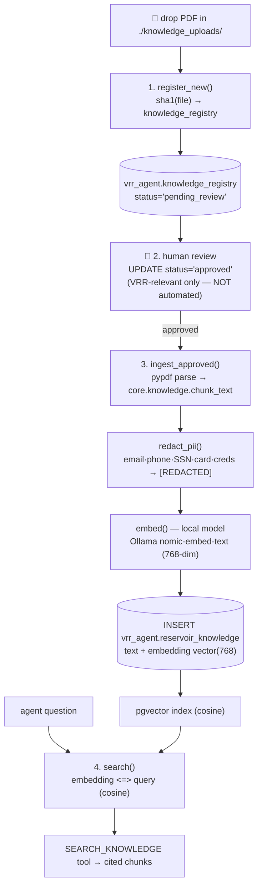

# PDF → vector DB (pgvector) — knowledge ingestion flow

How reservoir PDFs become searchable semantic memory, fully local (no cloud vector
service). Code: [pipeline/knowledge_ingest.py](../src/vrr_agent_open/pipeline/knowledge_ingest.py)
+ pure text ops in [core/knowledge.py](../src/vrr_agent_open/core/knowledge.py).



## The four steps

| Step | Function | What happens |
|---|---|---|
| 1. Register | `register_new()` | Every new PDF in `./knowledge_uploads/` gets a `knowledge_registry` row, `status='pending_review'`. Nothing else touches it. |
| 2. Review | *(human SQL)* | A reviewer confirms it's VRR-relevant and sets `status='approved'`. **Deliberately manual** — relevance is not automated (guardrail). |
| 3. Ingest | `ingest_approved()` | Parse (pypdf) → **chunk** (paragraph-aware + overlap) → **PII detect & REDACT** (PII never reaches the DB) → **embed** with a local model → `INSERT` into `reservoir_knowledge` with the `vector(768)` embedding. |
| 4. Search | `search()` | The agent's `SEARCH_KNOWLEDGE` tool runs `embedding <=> query` (pgvector cosine `<=>`), returns the top-k cited chunks. |

## Why pgvector (vs a separate vector service)

- **Same database** as the VRR data — one store, one backup, one connection; no
  extra service, no cost. The embedding lives in `vrr_agent.reservoir_knowledge`
  next to the governed tables.
- **Cosine search** is `ORDER BY embedding <=> query LIMIT k` — plain SQL.
- Add an ANN index for scale: `CREATE INDEX ON vrr_agent.reservoir_knowledge
  USING hnsw (embedding vector_cosine_ops);`

## Loading other formats, and choosing a chunker

Ingest loads through [document_loaders.py](../src/vrr_agent_open/pipeline/document_loaders.py)
and chunks through [text_splitters.py](../src/vrr_agent_open/pipeline/text_splitters.py).
Both run standalone, so you can see what a change does before it reaches the index:

```bash
make loaders                      # ./knowledge_uploads → List[Document] + metadata summary
make loaders from=./docs          # any folder: mixed .pdf/.txt/.html/.docx/.csv in one pass
make loaders from=https://…       # a URL (WebBaseLoader)
make chunks                       # score chunking strategies by retrieval, not by eye
make floor                        # measure the similarity floor that separates
                                  #   "the docs answer this" from "they don't"
```

| Format | Loader | Granularity |
|---|---|---|
| `.pdf` | `PyPDFLoader` (`PyMuPDFLoader` via `backend="pymupdf"`) | one Document per page |
| `.txt` `.md` | `TextLoader` | one Document per file |
| `.html` | `BSHTMLLoader` | one Document, markup stripped |
| `.docx` | `Docx2txtLoader` | one Document per file |
| `.csv` | `CSVLoader` | **one Document per row** |
| folder | per-suffix dispatch | mixed formats in one pass, bad files skipped |
| URL(s) | `WebBaseLoader` | one Document per URL |
| complex | `UnstructuredFileLoader` | optional extra: scans, tables, slides |

`file_name`/`page`/`file_type` are normalised across every loader (and pages made
1-based), because a chunk that cannot be cited is one the RAG answer has to drop or fake.

**PyPDF vs PyMuPDF**: same Document shape, so nothing downstream changes. `pypdf` is pure
Python and is the default; `pymupdf` is a C library — faster and better on multi-column
layouts, so it is the one for a bulk backfill (`pip install -e ".[fastpdf]"`).

### Chunking is judged by retrieval, never by eye

Each chunk is embedded in isolation, so context lost at a boundary is unrecoverable at
query time. Measured on the same procedure text (`make chunks`):

| Strategy | chunks | ends on a sentence | recall@2 | MRR |
|---|---|---|---|---|
| fixed (200 chars) | 4 | 25% | **0.33** | 0.56 |
| **recursive (400/60)** — default | 3 | 100% | **1.00** | 1.00 |
| semantic (cosine 0.75) | 9 | 100% | **0.67** | 0.78 |

Fixed-size splitting cuts `"…the response factor rho … It starts │ at 0.85…"`, and the
question "what does rho start at?" then ranks the chunk holding `0.85` third — outside
the top-k that reaches the prompt. Semantic chunking is *not* automatically best: on
short, dense procedure text it over-splits (83-char chunks carry too little context).

**The test, in short** — `retrieval_check()`: label questions with a phrase the retrieved
chunk MUST contain, embed each strategy's chunks, score recall@k and MRR. A chunking
change is only better if retrieval gets better. Grow `PROBES` from real questions in
`vrr_agent.chat_history`.

## Knowing when NOT to answer

`search()` filters by a similarity FLOOR, not just top-k. Without one, `LIMIT k` always
returns k rows: ask something the corpus never covered and the model still receives
excerpts, which is exactly when it invents an answer.

The floor is **measured, not guessed** (`make floor`) — and the measurement mattered:

```
ANSWERABLE  min top-1  0.671    ("how much can I change injection in one step?")
OFF-TOPIC   max top-1  0.564    ("flare gas recovery compressor trip setpoint")
gap +0.107  →  VRR_RETRIEVAL_MIN_SCORE = 0.62
```

`nomic-embed-text` scores *unrelated* text at 0.40-0.56, so an intuitive 0.35 admits
everything and the agent never abstains. At 0.62 it does:

> I don't know — the ingested documents contain nothing relevant to that (nothing scored
> above 0.62). Either the document covering it has not been ingested, or it is a
> field-data question — ask about a pattern and period and the deterministic tools will
> answer it from Postgres.

The model is **not called** on that path, so it cannot be talked into answering anyway.
`rulebook_unanswerable` in `data/evaluation/vrr_questions.py` keeps it honest: without a
negative case, a retriever that always returns its k nearest rows scores identically to
one that knows when it has nothing.

A negative gap from `make floor` means no threshold separates the sets — that is a
retrieval problem (chunking, embedder), not a tuning problem.

## Guardrails preserved from the Databricks version

- **Human relevance gate** before anything is embedded (step 2).
- **PII redacted before storage** — the raw match never lands in the DB or index.
- **Every retrieved chunk is citable** (file_name + page), so the agent grounds
  knowledge claims the same way it grounds numbers.

## Run it

```bash
# local embedding model (once):  ollama pull nomic-embed-text
mkdir -p knowledge_uploads && cp your_report.pdf knowledge_uploads/
python -m vrr_agent_open.pipeline.knowledge_ingest      # register + ingest approved
# approve in SQL first:
#   UPDATE vrr_agent.knowledge_registry SET status='approved' WHERE file_name='your_report.pdf';
```

## The same flow, from the browser (since 2026-08-02)

`make knowledge` still works exactly as above. The workbench's **Knowledge** view drives
the identical pipeline over HTTP, so a document uploaded in a browser and one dropped in
the folder produce byte-identical chunks — `pipeline/knowledge_ingest._embed_one` is the
single implementation both call.

```
browser ──POST /api/knowledge/upload──▶ validate ──▶ quarantine (pending_review)
                                                          │  NOT searchable
                                    GET …/preview ◀────────┤  extracted text + PII
                                                          ▼
                          POST …/approve ──▶ _embed_one ──▶ pgvector ──▶ askable in chat
```

| Endpoint | Role | What it does |
|---|---|---|
| `POST /api/knowledge/upload` | data_steward, admin | validates, stores, registers `pending_review`. **Embeds nothing.** |
| `GET /api/knowledge/documents` | any signed-in | review queue + live corpus + quota usage |
| `GET …/{id}/preview` | data_steward, admin | real extracted text (PII-redacted), page and chunk counts |
| `POST …/{id}/approve` | data_steward, admin | embeds in the request; `reviewed_by` from the token |
| `POST …/{id}/reject` | data_steward, admin | records the refusal and its reason |
| `DELETE …/{id}` | data_steward, admin | drops the chunks; the registry row survives |

### The human gate did not move

The upload button does **not** embed. That was a deliberate refusal: `core/knowledge.py`
has always said VRR-relevance is a human judgement, and making a spinner shorter is not a
reason to delete a guardrail. What changed is only *where the human exercises it* — a
review panel showing the actual extracted text instead of a `psql UPDATE`. Approval then
embeds in the same request, so it is instant for the reviewer while still being a
decision, attributed and timestamped.

`tests/test_knowledge_upload.py::test_upload_does_not_embed` stubs the ingest path to
raise, so a future refactor that quietly embeds on arrival fails loudly.

### What the validator refuses

`core/upload_validation.py` is pure (bytes + filename → verdict) and unit-tested off-DB.
The browser's `accept=` filter is a convenience for the file picker and is **not counted
as a control** — any HTTP client skips it.

| Check | Refuses |
|---|---|
| allowlist | anything outside the 7 suffixes `document_loaders` can parse |
| filename | `../`, `C:\…`, NUL bytes, shell metacharacters, >180 chars |
| magic bytes | `.pdf` holding a ZIP, `x.exe.pdf`, MZ/ELF/gzip/RAR/OLE under any extension |
| text check | binary wearing `.txt` — by control-character fraction, not by codec |
| size | per kind: pdf 25 · docx 15 · csv 10 · html/text 5 MB, streamed and aborted mid-upload |
| zip bombs | `.docx` expansion ratio >120:1, >200 MB unpacked, traversal in entry names |
| dedupe | identical content under a new name (sha256, unique index) |
| quota | 200 documents / 20,000 chunks — a vector index is a *ranked* resource |

Two of these were found by running it rather than reading it. **"Try UTF-8, fall back to
Latin-1" is not a text check**: Latin-1 assigns all 256 byte values so the decode never
fails, leaving only the NUL test — 200 bytes of `/dev/urandom` uploaded with a 201. It
now measures the control-character fraction (prose ~0%, random bytes ~25%, threshold 10%).
And `WHERE (%(s)s IS NULL OR …)` 500s with `AmbiguousParameter`; the stubbed-DB tests
could not see it and the first screenshot could.

## Two corpora in one table (since 2026-08-02)

`doc_kind` splits `reservoir_knowledge` into `reservoir` (procedures, standards — what a
reservoir engineer reads) and `app_help` (this workbench's own user guide). `search()`
defaults to `reservoir` and **never mixes them**.

That is not tidiness. Top-k is a fixed budget, so "how do I approve a change?" would
otherwise compete with the injection-change *procedure* for the same four slots — and the
procedure wins on similarity, answering a question about a button with a paragraph about
valve limits.

```
                       ┌─ doc_kind='reservoir'  ← uploads, make knowledge
vrr_agent.reservoir_knowledge
                       └─ doc_kind='app_help'   ← make guide (generated)
```

`make guide` regenerates `docs/app-guide/*.md` **from `core/help_topics.py`** and ingests
it. The guide is generated rather than written so it cannot drift from the deterministic
answers the chat gives — a stale user guide inside a vector index is worse than none,
because the agent quotes it with a citation. Editing the markdown by hand is overwritten.

App questions are answered from the written topic table first (`chat._help_answer`);
retrieval over `app_help` is only the long-tail fallback. The reason is the one this whole
project turns on: a fabricated *figure* is caught by `core.faithfulness`, but fabricated
*UI* makes no numeric claim and passes every check here.
